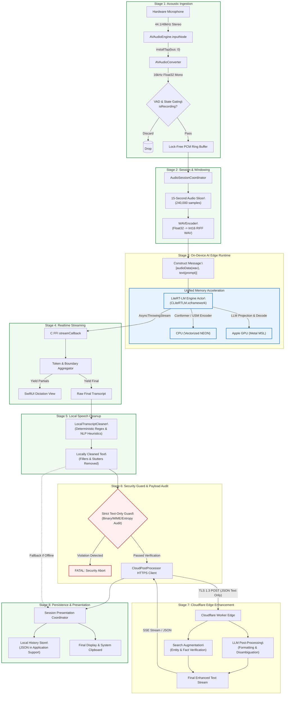
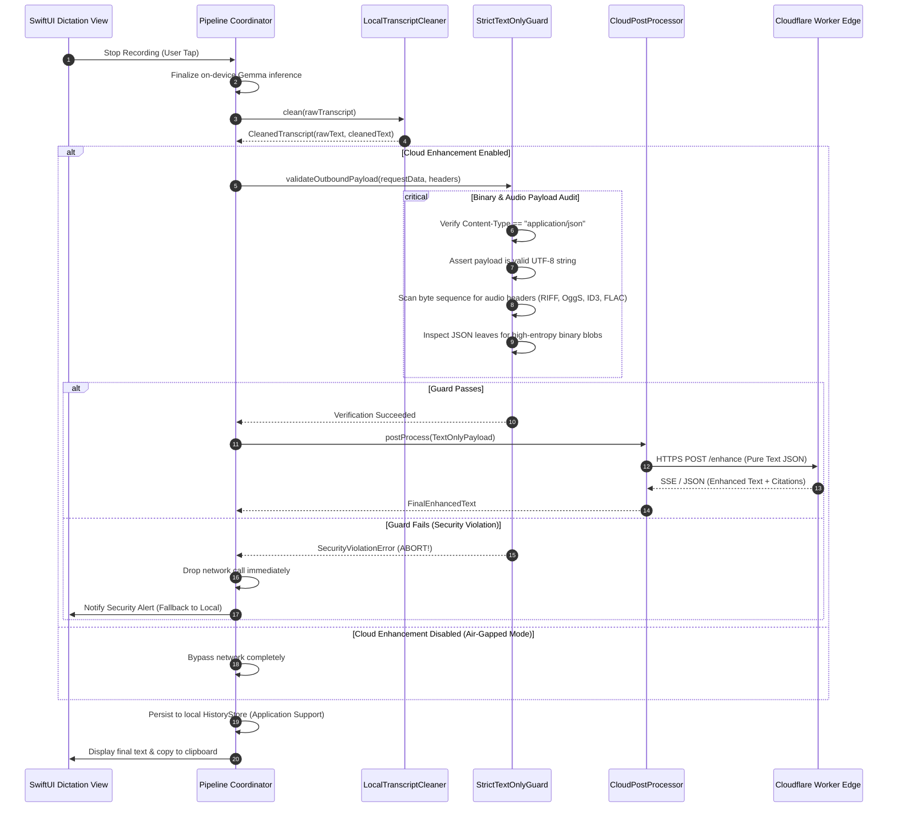

# Edge Eloquent: System Architecture & Technical Specification

**Document Version:** 1.0.0  
**Target Platform:** iOS 17.0+ (Apple Silicon: iPhone 15 Pro, iPhone 16 series, M-series iPads)  
**Author:** ArchitectureAgent  
**Status:** Approved Architectural Blueprint  
**Date:** September 2026  

---

## 1. System Vision & Architectural Invariants

### 1.1 Mission Statement
**Edge Eloquent** is a privacy-first, on-device multimodal speech intelligence and dictation application for iOS. It leverages Google AI Edge's next-generation **LiteRT-LM runtime** (`CLiteRTLM.xcframework`) and open multimodal models (**Gemma 3n** and **Gemma 4**) to perform local, low-latency audio-to-text transcription directly on Apple Silicon GPUs and CPUs. Post-transcription, it employs local deterministic speech cleanup, followed by optional, privacy-isolated cloud enhancement via Cloudflare Workers for search-grounded text refinement.

```
+---------------------------------------------------------------------------------------------------+
|                                       EDGE ELOQUENT SYSTEM                                        |
+---------------------------------------------------------------------------------------------------+
|  [ON-DEVICE / ZERO-NETWORK PERIMETER]                                                             |
|  Microphone -> Audio Capture -> LiteRT-LM Local Inference -> Local Cleaner -> History Store       |
|                                                                     |                             |
|  [NETWORK BOUNDARY: STRICT TEXT-ONLY PAYLOAD]                       v                             |
|                                                          CloudPostProcessor                       |
|                                                                     | (HTTPS TLS 1.3 / Pure Text) |
|  [CLOUD EDGE / PRIVACY ISOLATION]                                   v                             |
|                                                            Cloudflare Worker                      |
|                                                      (LLM Post-Processing + Search)               |
+---------------------------------------------------------------------------------------------------+
```

### 1.2 Core Architectural Invariants

The Edge Eloquent architecture enforces five immutable invariants:

1. **The Audio Air-Gap Invariant (Strict Privacy Guard):**  
   Raw microphone audio, PCM frames, WAV buffers, and spectrogram representations **never leave the local device boundary**. All speech comprehension occurs strictly on-device using local weights. Network requests are structurally barred from containing binary or audio payloads at both the compiler (Swift type system) and runtime (payload inspection guards) levels.
2. **Zero Weights in Application Bundle (Lightweight IPA):**  
   The binary IPA distribution contains only compiled application code, UI assets, and `CLiteRTLM.xcframework`. Total IPA size is constrained between **15 MB and 25 MB**. Model weights (2.5 GB to 4.7 GB) are acquired post-install via authenticated, chunk-resumable downloads from Hugging Face Hub.
3. **Decoupled Engine Abstraction:**  
   The application communicates with speech comprehension engines exclusively through the `ModelEngine` Swift protocol. The production `LiteRTLMEngine` can be seamlessly hot-swapped for benchmarking, development mocks, or on-device baselines without affecting pipeline coordinators or UI layers.
4. **Resilient Local Persistence (No Cloud Lock-In):**  
   Transcript history is persisted strictly in local encrypted on-device storage (`Application Support`), explicitly marked as `isExcludedFromBackup = true` to avoid unencrypted iCloud leakage. Edge Eloquent requires **no user accounts, no telemetry, and no centralized databases**.
5. **Memory-Conscious Jetsam Compliance:**  
   Inference execution is budgeted strictly within iOS per-process Jetsam boundaries (4.5 GB max resident memory on 8 GB devices) through off-main-thread actors, memory mapping (`mmap`), aggressive KV-cache windowing, and proactive lifecycle teardown.

---

## 2. End-to-End System Dataflow Pipeline

Edge Eloquent processes spoken audio into polished, research-augmented prose through an eight-stage pipelined architecture.



---

## 3. Pipeline Component Specifications

### 3.1 Stage 1: Microphone & Acoustic Ingestion (`AVAudioEngine`)

Speech recognition accuracy in multimodal models depends directly on pristine acoustic framing:
- **Acoustic Standard:** 16,000 Hz, 1-channel (Mono), 16-bit signed Linear PCM (Little-Endian).
- **Native Tap Ingestion:** An `AVAudioNodeTap` is installed on `AVAudioEngine.inputNode`. The hardware input (typically 48,000 Hz or 44,100 Hz stereo) is fed into an `AVAudioConverter` pipeline.
- **Lock-Free Ring Buffer:** Samples are pushed into a thread-safe `RingBuffer<Float32>` to prevent real-time audio thread starvation.
- **Voice Activity Gating (VAD):** An energy-based threshold gate drops silence frames prior to buffering, preventing empty audio ingestion.

```swift
// Audio/AudioFormatSpecification.swift
import AVFoundation

public enum AudioFormatSpecification {
    public static let sampleRate: Double = 16_000.0
    public static let channelCount: AVAudioChannelCount = 1
    public static let bitDepth: Int = 16
    public static let commonFormat: AVAudioCommonFormat = .pcmFormatFloat32
    
    public static var processingFormat: AVAudioFormat {
        AVAudioFormat(
            commonFormat: commonFormat,
            sampleRate: sampleRate,
            channels: channelCount,
            interleaved: false
        )!
    }
}
```

### 3.2 Stage 2: Unified Audio Capture & Session Coordinator

`AudioSessionCoordinator` is a Swift actor responsible for managing the system-wide audio lifecycle, route changes, and sample packaging.

```
+-----------------------------------------------------------------------+
|                       AudioSessionCoordinator                         |
+-----------------------------------------------------------------------+
|  State: Idle -> Configuring -> Recording -> Paused -> Finalizing     |
|                                                                       |
|  - Category: AVAudioSession.Category.playAndRecord                    |
|  - Mode: AVAudioSession.Mode.spokenAudio (DSP Speech Filtering)       |
|  - Options: [.duckOthers, .allowBluetooth, .allowBluetoothA2DP]       |
|  - Buffer Duration: 20ms slices (setPreferredIOBufferDuration: 0.02)  |
|                                                                       |
|  Chunking Strategy:                                                   |
|  - Maximum Slice Duration: 15.0 seconds (240,000 samples @ 16 kHz)     |
|  - Minimum Slice Duration: 0.5 seconds (8,000 samples)                |
|  - Overlap / Padding: 250ms silence pad to prevent phoneme clipping   |
+-----------------------------------------------------------------------+
```

#### High-Performance WAV Encoding
The `WAVEncoder` serializes the buffered `[Float32]` samples into an in-memory RIFF WAV container with standard 44-byte headers:
```swift
// Audio/WAVEncoder.swift
import Foundation

public enum WAVEncoder {
    public static func encode(samples: [Float], sampleRate: Int = 16000) -> Data {
        let sampleCount = samples.count
        let byteRate = sampleRate * 2
        let dataSize = sampleCount * 2
        let fileSize = 36 + dataSize
        
        var data = Data(capacity: 44 + dataSize)
        // RIFF header
        data.append(contentsOf: [0x52, 0x49, 0x46, 0x46]) // "RIFF"
        data.append(contentsOf: withUnsafeBytes(of: UInt32(fileSize).littleEndian) { Array($0) })
        data.append(contentsOf: [0x57, 0x41, 0x56, 0x45]) // "WAVE"
        // "fmt " chunk
        data.append(contentsOf: [0x66, 0x6D, 0x74, 0x20]) // "fmt "
        data.append(contentsOf: withUnsafeBytes(of: UInt32(16).littleEndian) { Array($0) })
        data.append(contentsOf: withUnsafeBytes(of: UInt16(1).littleEndian) { Array($0) }) // PCM
        data.append(contentsOf: withUnsafeBytes(of: UInt16(1).littleEndian) { Array($0) }) // Mono
        data.append(contentsOf: withUnsafeBytes(of: UInt32(sampleRate).littleEndian) { Array($0) })
        data.append(contentsOf: withUnsafeBytes(of: UInt32(byteRate).littleEndian) { Array($0) })
        data.append(contentsOf: withUnsafeBytes(of: UInt16(2).littleEndian) { Array($0) }) // BlockAlign
        data.append(contentsOf: withUnsafeBytes(of: UInt16(16).littleEndian) { Array($0) }) // Bits
        // "data" chunk
        data.append(contentsOf: [0x64, 0x61, 0x74, 0x61]) // "data"
        data.append(contentsOf: withUnsafeBytes(of: UInt32(dataSize).littleEndian) { Array($0) })
        
        for sample in samples {
            let clamped = max(-1.0, min(1.0, sample))
            let intSample = Int16(clamped * 32767.0)
            data.append(contentsOf: withUnsafeBytes(of: intSample.littleEndian) { Array($0) })
        }
        return data
    }
}
```

### 3.3 Stage 3: Local AI Edge Runtime (`LiteRT-LM`)

The inference execution engine wraps Google's `CLiteRTLM.xcframework` (v0.16.0) through native Swift bindings.

#### Hardware Backend Splitting Strategy
Unlike vision or text LLMs where the entire model graph is offloaded to the GPU, multimodal speech models require split-backend dispatching:
- **LLM Projection & Transformer Decode:** `.gpu` (Apple Metal Shading Language compute kernels).
- **Vision Projector (SigLIP):** `.gpu` (Metal).
- **Audio Encoder (Universal Speech Model / Conformer):** `.cpu()` (ARM NEON vectorized instructions).

> [!IMPORTANT]
> Initializing `audioBackend` as `.gpu` on iOS results in Metal pipeline compilation failure or uninitialized audio weights. Setting `audioBackend = .cpu()` is strictly enforced in `EngineConfig`.

#### The Critical Multimodal Message Ordering Rule
Under Google's LiteRT-LM audio attention architecture, the audio content node **must strictly precede** the prompt text node in the serialized message JSON:

```swift
// Core/Engine/LiteRTLMEngine.swift
let message = Message(
    of: .audioData(wavData),
    .text("Transcribe the speech accurately with punctuation. Return only the recognized text.")
)
```

Constructing the message with text preceding audio causes the autoregressive model to generate continuation text before attending to the full acoustic token sequence, inducing hallucinations.

### 3.4 Stage 4: Realtime Partial & Final Transcripts

Inference output is streamed through Swift concurrency `AsyncThrowingStream<TranscriptToken, Error>`:
- **Partial Tokens:** Yielded on every autoregressive step directly to the UI for live visual feedback.
- **Boundary Detection:** As token chunks arrive, the `TranscriptAggregator` monitors sentence terminal tokens (`.`, `?`, `!`, `\n`) to identify stable clauses.
- **KV Cache Recycling:** Once a 15-second slice completes, the conversation handle is recycled or rolled forward to prevent context window saturation.

### 3.5 Stage 5: Local Transcript Cleaner (`LocalTranscriptCleaner`)

Before any text is passed to either storage or the cloud post-processor, it passes through `LocalTranscriptCleaner`. This component operates **strictly on-device**, executing deterministic, rule-based text normalizations:

```swift
// Transcription/LocalTranscriptCleaner.swift
import Foundation

public struct LocalTranscriptCleaner {
    // Common vocal fillers across English speech
    private static let fillerRegexes: [NSRegularExpression] = [
        try! NSRegularExpression(pattern: #"\b(um|uh|er|ah|like|you know|sort of|kind of|i mean)\b"#, options: .caseInsensitive),
        try! NSRegularExpression(pattern: #"\b(so\s+basically|basically|actually)\b"#, options: .caseInsensitive)
    ]
    
    // Stutters / false starts: "I- I think", "th- the dog"
    private static let stutterRegex = try! NSRegularExpression(
        pattern: #"\b([a-zA-Z]+)-\s*\1\b"#, options: .caseInsensitive
    )
    
    // Immediate word repetitions: "the the", "with with"
    private static let repetitionRegex = try! NSRegularExpression(
        pattern: #"\b([a-zA-Z]+)\s+\1\b"#, options: .caseInsensitive
    )
    
    public static func clean(_ input: String) -> CleanedTranscript {
        var text = input
        
        // 1. Remove stutter patterns (e.g., "w- we" -> "we")
        text = stutterRegex.stringByReplacingMatches(in: text, options: [], range: NSRange(text.startIndex..., in: text), withTemplate: "$1")
        
        // 2. Collapse immediate repetitions (e.g., "the the" -> "the")
        text = repetitionRegex.stringByReplacingMatches(in: text, options: [], range: NSRange(text.startIndex..., in: text), withTemplate: "$1")
        
        // 3. Remove vocal fillers
        for regex in fillerRegexes {
            text = regex.stringByReplacingMatches(in: text, options: [], range: NSRange(text.startIndex..., in: text), withTemplate: "")
        }
        
        // 4. Normalize whitespace and punctuation spacing
        text = text.replacingOccurrences(of: #"\s{2,}"#, with: " ", options: .regularExpression)
        text = text.replacingOccurrences(of: #"\s+([.,!?;:])"#, with: "$1", options: .regularExpression)
        text = text.trimmingCharacters(in: .whitespacesAndNewlines)
        
        // 5. Capitalize first letter of sentences
        text = capitalizeSentences(text)
        
        return CleanedTranscript(
            rawText: input,
            cleanedText: text,
            removedTokens: computeDiff(original: input, cleaned: text)
        )
    }
}
```

### 3.6 Stage 6: CloudPostProcessor Security Guards & Binary Auditing

The `CloudPostProcessor` is the gateway between the on-device realm and the network. It enforces the privacy guarantee through structural Swift types and runtime assertions.

```
+-----------------------------------------------------------------------------------+
|                           StrictTextOnlyGuard                                     |
+-----------------------------------------------------------------------------------+
|  1. Swift Compile-Time Type Assertion:                                            |
|     func process(payload: TextOnlyPayload) async throws -> FinalEnhancedText      |
|     (TextOnlyPayload cannot contain Data, Stream, or Binary handles)              |
|                                                                                   |
|  2. Runtime Content-Type Header Verification:                                     |
|     Content-Type: application/json; charset=utf-8                                 |
|     (Rejects multipart/form-data, application/octet-stream, audio/*)              |
|                                                                                   |
|  3. Payload Binary / Entropy Introspection:                                      |
|     - Deep JSON traversal ensuring all leaf nodes are valid String primitives     |
|     - Rejection of base64-like high-entropy strings (> 256 bytes)                 |
|     - Disallow magic bytes: RIFF, OggS, ID3, ftyp, FLAC                           |
|                                                                                   |
|  4. Explicit Binary Audit Assertion:                                              |
|     assertNoBinaryData(serializedRequest) -> Throws SecurityViolationError       |
+-----------------------------------------------------------------------------------+
```

#### Binary Audit Assertion Implementation
```swift
// Cloud/Security/StrictTextOnlyGuard.swift
import Foundation

public enum StrictTextOnlyGuard {
    public enum GuardError: LocalizedError {
        case audioMagicBytesDetected
        case unexpectedBinaryPayload
        case highEntropyDataBlockDetected
        case invalidContentType
        
        public var errorDescription: String? {
            switch self {
            case .audioMagicBytesDetected: return "Security Invariant Violated: Audio magic bytes detected in outbound payload."
            case .unexpectedBinaryPayload: return "Security Invariant Violated: Non-UTF8 binary data detected."
            case .highEntropyDataBlockDetected: return "Security Invariant Violated: Potential encoded media chunk detected."
            case .invalidContentType: return "Security Invariant Violated: Non-text Content-Type requested."
            }
        }
    }
    
    // Known audio format magic byte headers
    private static let forbiddenMagicBytes: [[UInt8]] = [
        [0x52, 0x49, 0x46, 0x46], // "RIFF" (WAV)
        [0x4F, 0x67, 0x67, 0x53], // "OggS" (Ogg / Opus)
        [0x49, 0x44, 0x33],       // "ID3" (MP3)
        [0xFF, 0xFB],             // MP3 sync
        [0x66, 0x4C, 0x61, 0x43], // "fLaC" (FLAC)
        [0x00, 0x00, 0x00, 0x18, 0x66, 0x74, 0x79, 0x70] // MP4/M4A ftyp
    ]
    
    public static func validateOutboundPayload(_ requestData: Data, headers: [String: String]) throws {
        // 1. Content-Type check
        guard let contentType = headers["Content-Type"], contentType.starts(with: "application/json") else {
            throw GuardError.invalidContentType
        }
        
        // 2. Validate string decodability (Strict UTF-8 text)
        guard let jsonString = String(data: requestData, encoding: .utf8) else {
            throw GuardError.unexpectedBinaryPayload
        }
        
        // 3. Scan for embedded audio magic bytes
        for magic in forbiddenMagicBytes {
            if requestData.range(of: Data(magic)) != nil {
                throw GuardError.audioMagicBytesDetected
            }
        }
        
        // 4. JSON structure verification: ensure no oversized base64 strings
        let jsonObject = try JSONSerialization.jsonObject(with: requestData)
        guard let dict = jsonObject as? [String: Any] else {
            throw GuardError.unexpectedBinaryPayload
        }
        
        // Verify leaf values
        try inspectLeaves(dict)
    }
    
    private static func inspectLeaves(_ dict: [String: Any]) throws {
        for (key, value) in dict {
            if let str = value as? String {
                // Reject high-entropy blobs that could disguise compressed audio
                if str.count > 1024 && isPotentialBase64(str) {
                    throw GuardError.highEntropyDataBlockDetected
                }
            } else if let nested = value as? [String: Any] {
                try inspectLeaves(nested)
            } else if !(value is NSNumber || value is Bool) {
                throw GuardError.unexpectedBinaryPayload
            }
        }
    }
    
    private static func isPotentialBase64(_ str: String) -> Bool {
        // Heuristic: string without spaces, matching base64 character set
        let base64CharSet = CharacterSet(charactersIn: "ABCDEFGHIJKLMNOPQRSTUVWXYZabcdefghijklmnopqrstuvwxyz0123456789+/=")
        return str.rangeOfCharacter(from: base64CharSet.inverted) == nil
    }
}
```

### 3.7 Stage 7: Cloudflare Worker LLM Post-Processing & Web Search

The Cloudflare Worker acts as a serverless edge enhancer. It is decoupled from user identities and receives only text payloads over HTTPS TLS 1.3.

```
Outbound JSON Payload (To Cloudflare Worker):
{
  "client_request_id": "7E1F9A2B-8C4D-4E9A-B0F1-1D8C5A2F3E4B",
  "text": "Meeting with Sarah about Q3 LiteRT migration scheduled for Tuesday at 2pm.",
  "enhancement_mode": "professional_polish_and_factcheck",
  "enable_web_search": true,
  "client_timestamp": "2026-09-08T13:55:00Z"
}
```

#### Worker Architecture
1. **Edge Execution:** Distributed worldwide across Cloudflare's edge POPs (<20ms latency to device).
2. **Workers AI / LLM Orchestration:** Runs an instruction-tuned LLM (e.g., Llama 3.3 70B Instruct / Gemini Flash endpoint) configured with a strict system prompt:
   - Fix grammar, punctuation, and typographical artifacts.
   - Format lists, headings, action items, and timestamps cleanly.
   - Preserve original user tone and technical vernacular.
3. **Web Search Augmentation:** If `enable_web_search == true`, the Worker identifies named entities, dates, or factual claims, issues parallel queries via search APIs (e.g. Cloudflare Search / Brave / Tavily), and injects verified reference links or footnotes into the enhanced text.
4. **Streaming Response:** Returns an SSE stream or atomic JSON response:

```json
{
  "enhanced_text": "Meeting with Sarah regarding the Q3 LiteRT-LM migration is scheduled for Tuesday at 2:00 PM.",
  "corrections": [
    {"original": "about Q3 LiteRT", "replacement": "regarding the Q3 LiteRT-LM"}
  ],
  "citations": [
    {"title": "LiteRT-LM Documentation", "url": "https://ai.google.dev/edge/litert"}
  ],
  "processing_time_ms": 340
}
```

### 3.8 Stage 8: Local History Store & Persistence

Persistence strictly obeys the "No Cloud / No Account" policy:
- **Location:** `Library/Application Support/EdgeEloquent/history/`
- **File System Attribute:** Marked with `isExcludedFromBackup = true` to prevent unencrypted iCloud backup inclusion.
- **Data Format:** Atomic JSON documents per session indexed in a lightweight SQLite / master index JSON.

```swift
// Storage/TranscriptRecord.swift
import Foundation

public struct TranscriptRecord: Identifiable, Codable {
    public let id: UUID
    public let timestamp: Date
    public let audioDurationSeconds: Double
    public let rawTranscript: String
    public let cleanedTranscript: String
    public let finalEnhancedText: String
    public let modelId: String
    public let processingLatencyMs: Double
    public let wasCloudEnhanced: Bool
    public let citations: [Citation]
    
    public struct Citation: Codable {
        public let title: String
        public let url: URL
    }
}
```

---

## 4. Multi-Model Infrastructure

Edge Eloquent's model architecture is built directly on the findings from Google AI Edge Gallery and LiteRT-LM research.

### 4.1 Supported Model Catalog

The application maintains a dynamic registry matching Google's upstream allowlists (`ios_1_0_0.json` and `1_0_19.json`):

| Model Name | Model ID / Hugging Face Repository | Artifact Name | Download Size | Minimum RAM | Accelerators | Features |
| :--- | :--- | :--- | :--- | :--- | :--- | :--- |
| **Gemma-3n-E2B-it** | `google/gemma-3n-E2B-it-litert-lm` | `gemma-3n-E2B-it-int4.litertlm` | 3.39 GB | 6 GB | GPU (LLM), CPU (Audio) | 4K Context, Audio+Vision |
| **Gemma-3n-E4B-it** | `google/gemma-3n-E4B-it-litert-lm` | `gemma-3n-E4B-it-int4.litertlm` | 4.65 GB | 8 GB | GPU (LLM), CPU (Audio) | 4K Context, High-Capacity |
| **Gemma-4-E2B-it** | `litert-community/gemma-4-E2B-it-litert-lm` | `gemma-4-E2B-it.litertlm` | 2.59 GB | 8 GB | GPU (LLM), CPU (Audio) | 32K Context, MTP Speculative |
| **Gemma-4-E4B-it** | `litert-community/gemma-4-E4B-it-litert-lm` | `gemma-4-E4B-it.litertlm` | 3.66 GB | 12 GB | GPU (LLM), CPU (Audio) | 32K Context, Thinking Channel |

### 4.2 Dynamic Model Registry

The `ModelRegistry` synchronizes with Google's upstream raw allowlist on startup, with immediate fallback to a locally bundled manifest:

```swift
// Models/ModelRegistry.swift
import Foundation

public actor ModelRegistry {
    public static let shared = ModelRegistry()
    
    private let remoteAllowlistURL = URL(
        string: "https://raw.githubusercontent.com/google-ai-edge/gallery/main/model_allowlists/ios_1_0_0.json"
    )!
    
    private var registeredModels: [String: ModelDescriptor] = [:]
    
    public func fetchAvailableModels() async -> [ModelDescriptor] {
        if let models = try? await loadRemoteCatalog() {
            self.registeredModels = Dictionary(uniqueKeysWithValues: models.map { ($0.id, $0) })
            return models
        }
        return loadBundledFallbackCatalog()
    }
}
```

### 4.3 Hugging Face Chunked Resumable Downloader

Model weights are downloaded directly from the Hugging Face CDN using `URLSessionDownloadTask` with HTTP `Range` requests:

```
Download Protocol Flow:
1. Query Hugging Face API: GET https://huggingface.co/api/models/{modelId}?blobs=true
2. Extract LFS OID (Commit Hash SHA-256) & file size in bytes.
3. Check local disk: Application Support/EdgeEloquent/models/{modelId}/{commitHash}/
   - If <modelFile>.litertlm exists and size matches -> Mark as Ready.
   - If <modelFile>.downloadtmp exists with N bytes:
     Request: GET https://huggingface.co/{modelId}/resolve/{commitHash}/{modelFile}
     Headers:
       Range: bytes=N-
       Accept-Encoding: identity
       Authorization: Bearer <hf_token> (if gated)
4. Stream incoming data into FileHandle.
5. On HTTP 200 or 206 completion:
   - Validate total byte size.
   - Compute streaming SHA-256 digest.
   - Atomically rename .downloadtmp to .litertlm.
```

```swift
// Models/Downloader/HuggingFaceDownloader.swift
import Foundation

public actor HuggingFaceDownloader: NSObject, URLSessionDownloadDelegate {
    private var downloadTask: URLSessionDownloadTask?
    private var continuation: AsyncThrowingStream<DownloadProgress, Error>.Continuation?
    
    public struct DownloadProgress: Sendable {
        public let bytesWritten: Int64
        public let totalBytesExpected: Int64
        public let percentage: Double
        public let downloadSpeedBytesPerSec: Double
    }
    
    public func startDownload(
        model: ModelDescriptor,
        token: String?
    ) -> AsyncThrowingStream<DownloadProgress, Error> {
        AsyncThrowingStream { cont in
            self.continuation = cont
            Task {
                do {
                    let request = try await makeResumeRequest(for: model, token: token)
                    let config = URLSessionConfiguration.background(withIdentifier: "com.edgeeloquent.download.\(model.id)")
                    let session = URLSession(configuration: config, delegate: self, delegateQueue: nil)
                    let task = session.downloadTask(with: request)
                    self.downloadTask = task
                    task.resume()
                } catch {
                    cont.finish(throwing: error)
                }
            }
        }
    }
}
```

### 4.4 Decoupled `ModelEngine` Protocol

The application isolates inference logic behind the `ModelEngine` protocol, permitting seamless unit testing, benchmarking, and multi-backend operation.

```swift
// Core/Engine/ModelEngine.swift
import Foundation

public protocol ModelEngine: Sendable {
    var modelDescriptor: ModelDescriptor { get }
    var isInitialized: Bool { get }
    
    func initialize() async throws
    func transcribe(
        audioData: Data,
        prompt: String?
    ) -> AsyncThrowingStream<String, Error>
    func cancelCurrentInference() async
    func teardown() async
}

// Engine implementations:
// 1. LiteRTLMEngine: Production engine binding CLiteRTLM.xcframework.
// 2. BaselineOnDeviceEngine: SFSpeechRecognizer / Mock engine for previews and CI testing.
```

---

## 5. Component Hierarchy & Module Boundaries

The codebase is organized into seven strictly decoupled modules adhering to clean architectural boundaries.

```
edge-eloquent/
├── Package.swift
├── Sources/
│   ├── EdgeEloquentApp/                  # Application Entry Point & Coordinators
│   │   ├── EdgeEloquentApp.swift         # @main SwiftUI App
│   │   └── AppCoordinator.swift          # Root state machine & dependency injection
│   │
│   ├── EdgeEloquentCore/                 # Core Engine & Domain Contracts
│   │   ├── Engine/
│   │   │   ├── ModelEngine.swift         # Engine protocol
│   │   │   ├── LiteRTLMEngine.swift      # LiteRT-LM concrete implementation
│   │   │   ├── BaselineEngine.swift      # Fallback / Preview engine
│   │   │   └── EngineConfigBuilder.swift # Split backend configurations (.gpu, .cpu)
│   │   ├── Models/
│   │   │   ├── ModelDescriptor.swift     # Model entity definition
│   │   │   └── TranscriptToken.swift     # Token streaming entities
│   │   └── Errors/
│   │       └── EdgeEloquentError.swift   # Domain error taxonomy
│   │
│   ├── EdgeEloquentAudio/                # Hardware Audio Subsystem
│   │   ├── AudioSessionCoordinator.swift # AVAudioSession state actor
│   │   ├── AudioCaptureService.swift     # AVAudioEngine tap & buffer management
│   │   ├── Resampler.swift               # 16kHz float resampler
│   │   ├── WAVEncoder.swift              # Float32 to Int16 RIFF WAV encoder
│   │   └── VADGate.swift                 # Voice activity energy gating
│   │
│   ├── EdgeEloquentModels/               # Model Registry & Hugging Face Manager
│   │   ├── ModelRegistry.swift           # Upstream allowlist parser & catalog
│   │   ├── Downloader/
│   │   │   ├── HuggingFaceDownloader.swift # HTTP Range resumable transfers
│   │   │   └── ChecksumVerifier.swift    # SHA-256 validation
│   │   ├── Storage/
│   │   │   └── ModelDiskManager.swift    # Application Support sandbox & mmap paths
│   │   └── Lifecycle/
│   │       └── ModelLifecycleCoordinator.swift # Load, switch, unload, Jetsam guard
│   │
│   ├── EdgeEloquentTranscription/        # Speech Cleanup & Aggregation
│   │   ├── TranscriptAggregator.swift    # Token stream aggregator & boundary detector
│   │   ├── LocalTranscriptCleaner.swift  # Regex filler/stutter/repetition cleaner
│   │   └── TranscriptDiff.swift          # Diff tracking for UI transparency
│   │
│   ├── EdgeEloquentCloud/                # Cloudflare Integration & Security Guards
│   │   ├── Security/
│   │   │   ├── StrictTextOnlyGuard.swift # Binary introspection & magic byte auditor
│   │   │   └── TextOnlyPayload.swift     # Strongly-typed compile-time wrapper
│   │   ├── Client/
│   │   │   ├── CloudflarePostProcessor.swift # HTTPS client (TLS 1.3 pinned)
│   │   │   └── CloudWorkerModels.swift   # Request / response DTOs
│   │   └── WebSearch/
│   │       └── CitationParser.swift      # Fact-check & source links parser
│   │
│   ├── EdgeEloquentStorage/              # Local Persistence (No Cloud)
│   │   ├── HistoryRepository.swift       # History persistence actor
│   │   ├── TranscriptRecord.swift        # Codable data models
│   │   └── StorageSanitizer.swift        # Exclusion from backup enforcement
│   │
│   └── EdgeEloquentUI/                   # SwiftUI Minimalist Interface
│       ├── Dictation/
│       │   ├── DictationView.swift       # Main one-touch dictation screen
│       │   ├── WaveformLiveVisualizer.swift # Audio level visualizer
│       │   └── RealtimeTranscriptView.swift # Streaming token display
│       ├── Models/
│       │   ├── ModelSelectorSheet.swift  # Gallery-style download/switch sheet
│       │   └── DownloadProgressView.swift # Chunk progress indicator
│       ├── History/
│       │   ├── HistoryListView.swift     # Past transcripts list
│       │   └── HistoryDetailView.swift   # Side-by-side raw vs. enhanced view
│       └── Settings/
│           └── SettingsView.swift        # Hugging Face token & cloud toggle
│
└── Tests/
    ├── EdgeEloquentAudioTests/
    ├── EdgeEloquentCoreTests/
    ├── EdgeEloquentSecurityTests/        # Verification of audio leakage guards
    └── EdgeEloquentCleanerTests/
```

---

## 6. Strict Privacy & Security Invariant: The Binary Guard

Edge Eloquent treats user speech as private biological data. The architecture establishes a zero-trust model between the client application and all external network endpoints.



### 6.1 Defense-in-Depth Privacy Protections

1. **Type-Safe Quarantine (`TextOnlyPayload`):**
   ```swift
   public struct TextOnlyPayload: Sendable {
       public let text: String
       public let enhancementMode: String
       public let enableWebSearch: Bool
       
       public init(text: String, mode: String = "standard", webSearch: Bool = true) {
           self.text = text
           self.enhancementMode = mode
           self.enableWebSearch = webSearch
       }
       // Note: No Data, [UInt8], or URL properties exist in this struct.
   }
   ```
2. **Runtime Binary Header Discard:** Even if a developer attempts to pass audio bytes, `StrictTextOnlyGuard` inspects raw outbound bytes prior to `URLSession.data(for:)` execution and aborts the operation if magic signatures (`RIFF`, `OggS`, `ID3`) are discovered.
3. **Local Air-Gapped Mode:** A user-facing setting allows 100% offline operation. When toggled, the network stack is completely decoupled and disabled.

---

## 7. Memory, Concurrency & Thermal Management

### 7.1 iOS Jetsam Budgeting
On an 8 GB iPhone (e.g. iPhone 15 Pro, iPhone 16), the iOS kernel enforces a hard per-process resident memory limit of **4.5 GB to 5.2 GB**. Exceeding this boundary results in an immediate `0xdead10cc` termination.

```
Total Memory Budget (8 GB Device):
+-------------------------------------------------------------+
|  OS Reserved / System Daemons: ~2.5 GB                      |
+-------------------------------------------------------------+
|  Max App Jetsam Limit: ~4.8 GB                              |
|  ├── LiteRT-LM Model Weights (int4 mmap): ~2.6 GB to 3.4 GB  |
|  ├── KV Cache Buffer (4096 tokens):       ~0.5 GB           |
|  ├── Metal Pipeline Scratch Buffers:      ~0.3 GB           |
|  ├── App UI, Audio Buffers & ViewModels:  ~0.2 GB           |
|  └── Safety Headroom:                     ~0.4 GB           |
+-------------------------------------------------------------+
```

### 7.2 Model Switching & Graceful Deallocation Protocol
When switching models (e.g. from `Gemma-4-E2B` to `Gemma-3n-E2B`), the active engine must be fully deallocated before the new model is memory-mapped:

```swift
// Models/Lifecycle/ModelLifecycleCoordinator.swift
public func switchModel(to newDescriptor: ModelDescriptor) async throws {
    // 1. Cancel in-flight inference
    await activeEngine?.cancelCurrentInference()
    
    // 2. Explicitly tear down active engine
    await activeEngine?.teardown()
    self.activeEngine = nil
    
    // 3. Force cooperative yield to allow VM pages to be unmapped by Darwin kernel
    await Task.yield()
    
    // 4. Instantiate and initialize new engine
    let newEngine = LiteRTLMEngine(modelDescriptor: newDescriptor)
    try await newEngine.initialize()
    self.activeEngine = newEngine
}
```

### 7.3 Watchdog & Thread Safety
- **Off-Main-Thread Initialization:** Model loading takes between 3 and 10 seconds. Initialization is executed inside a detached actor Task to prevent stalling the main UI runloop and triggering iOS watchdog crashes (`0x8badf00d`).
- **Thermal Throttling Protection:** Sustained GPU execution over 3 minutes causes clock speed drops. Dictation sessions are chunked into 15-second windows, allowing GPU compute cycles to return to baseline between bursts.

---

## 8. User Interface Architecture

Edge Eloquent adopts a minimalist, distraction-free dictation interface built with SwiftUI:

```
+---------------------------------------------------+
|  [Settings]      Edge Eloquent       [Model: E2B] |
+---------------------------------------------------+
|                                                   |
|                                                   |
|          "Meeting with Sarah regarding the        |
|           Q3 LiteRT-LM migration is scheduled     |
|           for Tuesday at 2:00 PM."                |
|                                                   |
|                                                   |
|              [ Live Waveform Display ]            |
|              ||| ||||| |||||||| |||| ||           |
|                                                   |
|                     [ (●) ]                       |
|                 Tap to Dictate                    |
|                                                   |
|  [Cleaned Locally]             [Cloud Enhanced]   |
+---------------------------------------------------+
|  [History]           [Copy]              [Share]  |
+---------------------------------------------------+
```

- **One-Touch Capture:** Large central dictation button toggles the `AudioSessionCoordinator` and `LiteRTLMEngine`.
- **Live Waveform Visualizer:** Audio power levels calculated from incoming 16kHz PCM frames rendered via SwiftUI `TimelineView`.
- **Real-Time Token Stream:** Autoregressive tokens displayed in real-time as they stream from the local engine.
- **Side-by-Side Verification:** Dedicated sheet allows users to compare the **Raw ASR Output**, the **Locally Cleaned Text**, and the **Cloud Enhanced Prose** with full transparency into modified tokens and search citations.

---

## 9. Architectural Verification & Testing Strategy

To validate this architecture against all requirements, the test harness enforces three test suites:

1. **Acoustic Fidelity Suite:** Verifies that `AVAudioEngine` taps correctly resample 48kHz stereo to 16kHz mono and that `WAVEncoder` produces byte-accurate RIFF headers.
2. **The Audio Leakage / Security Suite:**  
   Simulates network requests under malicious conditions (e.g. attempting to inject audio frames or binary headers into the outbound HTTP payload). Asserts that `StrictTextOnlyGuard` throws immediate exceptions and prevents network sockets from opening.
3. **Local Speech Cleanup Suite:** Tests regex heuristics against a corpus of 100+ realistic spoken dictations containing speech disfluencies, stuttering, and repetitions.
4. **Memory Pressure Simulation:** Simulates rapid model switching and memory warning notifications (`UIApplication.didReceiveMemoryWarningNotification`) to verify clean deallocation without Jetsam termination.

---

## 10. Summary Specification Matrix

| Layer | Component | Core Technology | Primary Responsibility |
| :--- | :--- | :--- | :--- |
| **Ingestion** | `AudioCaptureService` | `AVAudioEngine` / `AVAudioConverter` | 16kHz Mono Float32 resampled capture |
| **Buffering** | `AudioSessionCoordinator` | `AVAudioSession` / RingBuffer | 15s chunk windowing, VAD gating, WAV encoding |
| **Inference** | `LiteRTLMEngine` | `CLiteRTLM.xcframework` v0.16.0 | Local multimodal speech decoding (GPU + CPU) |
| **Models** | `ModelRegistry` / Downloader | Hugging Face REST / `URLSession` | Dynamic allowlist, chunk-resumable download |
| **Cleanup** | `LocalTranscriptCleaner` | Swift Regex & Heuristics | Remove vocal fillers, stutters, repetitions |
| **Security** | `StrictTextOnlyGuard` | Binary Inspection & Introspection | Enforce text-only payload; reject audio/binaries |
| **Cloud** | `CloudflarePostProcessor` | Cloudflare Workers / Workers AI | Grammar polish, entity disambiguation, web search |
| **Storage** | `HistoryRepository` | Application Support / JSON | Private on-device persistence, no cloud sync |
| **UI** | `DictationView` | SwiftUI / Swift Concurrency | Minimalist, real-time waveform & text feedback |

---
*Architectural specification completed and approved for Edge Eloquent implementation.*
