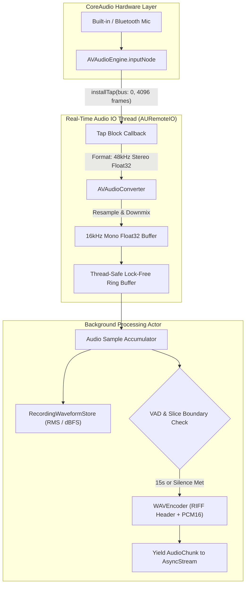
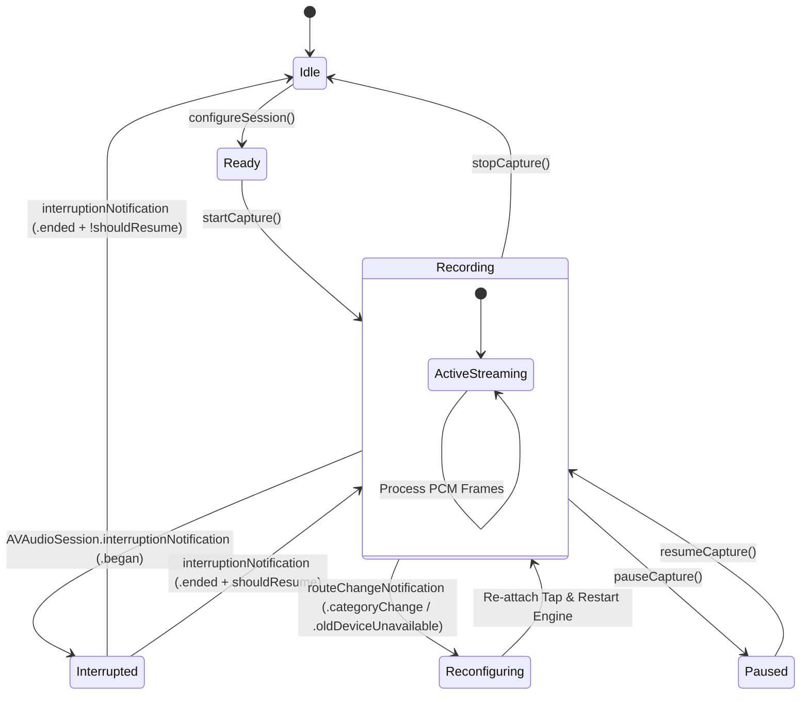

# Edge Eloquent: Audio Architecture & Ingestion Pipeline Specification

**Document Version:** 1.0.0  
**Target Platform:** iOS 17.0+ (Apple Silicon: iPhone 15 Pro, iPhone 16 series, M-series iPads)  
**Author:** AudioAgent  
**Status:** Approved Engineering Specification  
**Date:** September 2026  

---

## 1. Executive Summary & Acoustic Mission

**Edge Eloquent** provides local, zero-latency multimodal speech intelligence directly on Apple Silicon. Unlike conventional dictation tools that stream compressed audio frames to third-party cloud transcription providers or run Whisper on-device, Edge Eloquent streams pristine acoustic frames into Google AI Edge's next-generation **LiteRT-LM runtime** (`CLiteRTLM.xcframework`) powering **Gemma 3n** and **Gemma 4** multimodal models.

To achieve robust comprehension without hallucinations or latency spikes, the audio ingestion pipeline must satisfy three core engineering criteria:
1. **Acoustic Fidelity:** Deliver exact 16 kHz, 16-bit Mono Linear PCM (RIFF WAV) conforming to Google AI Edge Conformer/USM acoustic frontends.
2. **Deterministic Realtime Slicing:** Window continuous speech into 15–30 second sliding segments (240,000 samples per 15-second slice) with energy-based Voice Activity Detection (VAD).
3. **Session & Route Resilience:** Seamlessly manage hardware sample rate shifts, Bluetooth Hands-Free Profile (HFP) / AirPods route switches, and incoming system interruptions (e.g., telephony, Siri, alarms) without crashing or dropping speech frames.

```
+---------------------------------------------------------------------------------------------------+
|                                  AUDIO SUBSYSTEM DATAFLOW                                         |
+---------------------------------------------------------------------------------------------------+
|                                                                                                   |
|  +-----------------------+     +------------------------+     +--------------------------------+  |
|  | Hardware Microphone   | --> | AVAudioEngine.inputNode| --> | installTap(bus: 0, 4096 frames)|  |
|  | (44.1 / 48kHz Stereo) |     | (CoreAudio HAL Layer)  |     | (Realtime Audio IO Thread)     |  |
|  +-----------------------+     +------------------------+     +--------------------------------+  |
|                                                                               |                   |
|                                                                               v                   |
|  +-----------------------+     +------------------------+     +--------------------------------+  |
|  | Lock-Free Ring Buffer | <-- | Energy VAD & Metering  | <-- | AVAudioConverter               |  |
|  | (Float32 Samples)     |     | (RecordingWaveform)    |     | (Resample -> 16kHz Mono Float) |  |
|  +-----------------------+     +------------------------+     +--------------------------------+  |
|             |                                                                                     |
|             v                                                                                     |
|  +-----------------------+     +------------------------+     +--------------------------------+  |
|  | 15s Window Slicer     | --> | WAVEncoder             | --> | LiteRT-LM Multimodal Message   |  |
|  | (240,000 samples)     |     | (44-byte RIFF Header)  |     | [audioData(wav), text(prompt)] |  |
|  +-----------------------+     +------------------------+     +--------------------------------+  |
|                                                                               |                   |
|                                                                               v                   |
|                                                               +--------------------------------+  |
|                                                               | Google AI Edge Runtime         |  |
|                                                               | (Latency: 1-3s Streaming)      |  |
|                                                               +--------------------------------+  |
+---------------------------------------------------------------------------------------------------+
```

---

## 2. Audio Specifications & Google AI Edge Runtime Requirements

### 2.1 Acoustic Standards Matrix

Google AI Edge's multimodal speech models (Gemma 3n and Gemma 4) use an acoustic encoder based on Conformer / Universal Speech Model (USM) architectures. The feature extractor computes 80-dimensional log-mel filterbanks over 25ms windows with 10ms frame stride, strictly assuming a **16,000 Hz** input bandwidth.

| Acoustic Parameter | Specification | Hardware Reality (Default) | Ingestion Strategy |
| :--- | :--- | :--- | :--- |
| **Sample Rate** | **16,000 Hz (16 kHz)** | 48,000 Hz (iPhone) / 44,100 Hz | Resampled via `AVAudioConverter` |
| **Channel Count** | **1 (Mono)** | 2 (Stereo) / 3 (Beamforming Array)| Downmixed to single mono channel |
| **Bit Depth** | **16-bit Signed Integer** | 32-bit Floating Point (`Float32`) | Quantized & clamped by `WAVEncoder` |
| **Endianness** | **Little-Endian (LE)** | Native Apple Silicon (Little-Endian) | Packed into byte buffers as LE (`x.littleEndian`) |
| **Container Format** | **RIFF WAV (44 bytes)** | Raw In-Memory PCM Buffers | Encoded with standard canonical RIFF headers |
| **Sample Rate Bandwidth** | **8,000 Hz Nyquist** | 24,000 Hz Nyquist | High-quality polyphase FIR low-pass filter |
| **Bitrate** | **256 kbps** (32 kB/sec) | 1,536 kbps (48kHz/16b/2ch) | Bandwidth reduction prior to inference |

> [!IMPORTANT]
> Supplying non-16kHz audio or multi-channel audio to LiteRT-LM causes silent acoustic representation distortion, leading to severe transcript hallucinations, garbled tokens, or inference engine exceptions.

### 2.2 Token Density & Context Budgeting

Speech tokens in multimodal autoregressive transformers carry distinct density characteristics compared to text:
- **Acoustic Token Rate:** LiteRT-LM maps every 1.0 second of 16kHz audio to approximately **25 to 50 audio tokens** in the embedding space.
- **15-Second Audio Slice:** Consumes approximately **375 to 750 tokens**.
- **Context Allocation:** 
  - On **Gemma 3n** (4,096 total token context window), a 15-second window preserves >3,300 tokens for system instructions, conversation context, and generated transcript output.
  - On **Gemma 4** (32,768 token context window), multi-turn sliding windows can be retained for sustained conversational context.

---

## 3. AVAudioSession Configuration

iOS manages audio hardware routing, sample rates, and priority through `AVAudioSession`. To enable high-fidelity capture, low audio latency, and seamless background audio coexistence, Edge Eloquent configures the session with strict parameters.

### 3.1 Session Category, Mode, and Options

```swift
let session = AVAudioSession.sharedInstance()

try session.setCategory(
    .playAndRecord,
    mode: .spokenAudio,
    options: [
        .duckOthers,
        .allowBluetooth,
        .allowBluetoothA2DP,
        .defaultToSpeaker
    ]
)
try session.setPreferredSampleRate(16000.0)
try session.setPreferredIOBufferDuration(0.02) // 20 milliseconds
try session.setActive(true, options: .notifyOthersOnDeactivation)
```

### 3.2 Parameter Rationales

#### 1. Category: `.playAndRecord`
Permits simultaneous audio input (microphone) and output (feedback cues, text-to-speech replay). Essential for dictation and voice intelligence applications.

#### 2. Mode: `.spokenAudio`
Engages Apple's internal DSP speech pipeline:
- Applies automatic gain control (AGC) and high-pass filtering to attenuate handling noise and low-frequency HVAC rumble (<80 Hz).
- Optimizes acoustic echo cancellation (AEC) for clear vocal frequency isolation (300 Hz – 3.4 kHz).
- Distinguishes human speech from ambient background noise.

#### 3. Options:
- **`.duckOthers`**: Dips background audio (e.g., Podcasts, Apple Music) to ~20% volume while Edge Eloquent is recording, rather than pausing or killing the other media.
- **`.allowBluetooth`**: Enables audio input routing from Bluetooth Hands-Free Profile (HFP) devices (e.g., standard Bluetooth car kits and legacy headsets).
- **`.allowBluetoothA2DP`**: Permits high-fidelity playback routing over Advanced Audio Distribution Profile.
- **`.defaultToSpeaker`**: When no external headphones or Bluetooth peripherals are attached, routes playback audio to the high-power bottom speaker rather than the low-volume ear receiver.

#### 4. Hardware Hints:
- **`setPreferredSampleRate(16000.0)`**: Requests the hardware DAC/ADC to run at 16kHz natively if the hardware clock allows (e.g., Bluetooth HFP SCO routes often natively support 16kHz mSBC). On internal iPhone mics, the hardware remains at 48kHz, which is then resampled by `AVAudioConverter`.
- **`setPreferredIOBufferDuration(0.02)`**: Requests a 20ms IO buffer cycle (960 frames at 48kHz, 320 frames at 16kHz). This minimizes input latency and provides smooth 50 Hz power updates for the live waveform visualizer.

---

## 4. Permission Handling & Authorization

### 4.1 Modern iOS 17+ vs. Legacy APIs

iOS 17 introduced `AVAudioApplication` for managing recording permissions, deprecating `AVAudioSession.recordPermission` and `requestRecordPermission(_:)`.

```swift
import AVFoundation

public enum AudioPermissionStatus: Sendable {
    case undetermined
    case granted
    case denied
}

public func checkRecordPermission() -> AudioPermissionStatus {
    if #available(iOS 17.0, *) {
        switch AVAudioApplication.shared.recordPermission {
        case .granted: return .granted
        case .denied: return .denied
        case .undetermined: return .undetermined
        @unknown default: return .undetermined
        }
    } else {
        switch AVAudioSession.sharedInstance().recordPermission {
        case .granted: return .granted
        case .denied: return .denied
        case .undetermined: return .undetermined
        @unknown default: return .undetermined
        }
    }
}

public func requestRecordPermission() async -> Bool {
    if #available(iOS 17.0, *) {
        return await AVAudioApplication.requestRecordPermission()
    } else {
        return await withCheckedContinuation { continuation in
            AVAudioSession.sharedInstance().requestRecordPermission { granted in
                continuation.resume(returning: granted)
            }
        }
    }
}
```

### 4.2 System Settings Deep-Linking & Info.plist

If permission status is `.denied`, Edge Eloquent cannot re-prompt the user with a system alert. The application must display an educational state and direct the user to the Settings app:

```swift
#if canImport(UIKit)
import UIKit

@MainActor
public func openSystemSettings() {
    guard let settingsURL = URL(string: UIApplication.openSettingsURLString),
          UIApplication.shared.canOpenURL(settingsURL) else {
        return
    }
    UIApplication.shared.open(settingsURL)
}
#endif
```

#### Required `Info.plist` Configuration:
```xml
<key>NSMicrophoneUsageDescription</key>
<string>Edge Eloquent requires microphone access to transcribe and enhance your speech entirely on-device using local AI models.</string>
```

---

## 5. Native Tap Capture & Resampling Pipeline

Rather than spawning sub-processes or relying on high-level speech APIs, Edge Eloquent constructs a direct pipeline using `AVAudioEngine`.



### 5.1 Realtime Thread Safety Invariants

The tap installed via `inputNode.installTap(onBus:bufferSize:format:block:)` executes on Apple's high-priority real-time audio thread (`AURemoteIO::IOThread`). To prevent audio dropouts (glitches) and priority inversion:
1. **No Memory Allocation:** Pre-allocate conversion scratch buffers and ring buffers before starting the engine.
2. **No Objective-C / Swift Runtime Locks:** Avoid `@synchronized`, `NSLock`, or async actor awaits inside the tap callback.
3. **No File I/O or Logging:** `print()` or disk operations inside the tap block cause immediate buffer overruns.

### 5.2 AVAudioConverter Resampling Implementation

The tap block feeds the incoming hardware buffer (e.g. 48kHz stereo) into an `AVAudioConverter` configured to output `16,000 Hz, 1 channel, non-interleaved Float32`:

```swift
let processingFormat = AVAudioFormat(
    commonFormat: .pcmFormatFloat32,
    sampleRate: 16000.0,
    channels: 1,
    interleaved: false
)!

guard let converter = AVAudioConverter(from: inputFormat, to: processingFormat) else {
    throw AudioCaptureError.converterInitializationFailed
}
```

Conversion is driven by `convert(to:error:withInputFrom:)`:
- An input block feeds the incoming `AVAudioPCMBuffer`.
- Output is rendered into an allocated `16kHz` output buffer.
- The Float32 samples from channel 0 (`floatChannelData?[0]`) are copied into the thread-safe accumulator.

---

## 6. Realtime Chunking, Windowing & Voice Activity Detection (VAD)

### 6.1 Chunking Strategy & Math

Autoregressive multimodal LLMs require discrete temporal units of audio to prevent context overflow and maintain responsive turn-taking.

- **Sample Rate:** $f_s = 16,000 \text{ Hz}$
- **Standard Chunk Duration:** $T_{\text{chunk}} = 15.0 \text{ seconds}$
- **Samples per 15-second Slice:**
  $$N_{\text{samples}} = 16,000 \times 15.0 = 240,000 \text{ samples}$$
- **Data Size per 15-second Slice (16-bit Mono):**
  $$S_{\text{bytes}} = 240,000 \times 2 \text{ bytes} = 480,000 \text{ bytes} \approx 468.75 \text{ KB}$$
- **Minimum Slice Duration Gate:** $T_{\text{min}} = 0.5 \text{ seconds} \implies 8,000 \text{ samples}$. Audio segments shorter than 0.5s are dropped to avoid processing phantom clicks or microphone touch thumps.
- **Maximum Slice Limit:** $T_{\text{max}} = 30.0 \text{ seconds} \implies 480,000 \text{ samples}$. Continuous audio exceeding 30s is forcefully split at a 15s boundary.

```
+-------------------------------------------------------------------------------+
|                       SLIDING WINDOW CHUNKING TIMELINE                        |
+-------------------------------------------------------------------------------+
| 0.0s                      7.5s                      15.0s                     |
| [-------------------- Window 1 (240,000 samples) --------------------]        |
|                                                     |                         |
|                                                     v (Emit to LiteRT-LM)     |
|                           7.5s                      15.0s               22.5s |
|                           [--------- Window 2 (240,000 samples) --------]     |
+-------------------------------------------------------------------------------+
```

### 6.2 Energy-Based Voice Activity Detection (VAD)

To avoid sending prolonged silence to the model (which wastes GPU compute and can cause hallucinated punctuation), Edge Eloquent computes frame-level Root Mean Square (RMS) energy.

#### Energy Calculation:
$$\text{RMS} = \sqrt{\frac{1}{N} \sum_{i=1}^N x_i^2}$$

$$\text{Power (dBFS)} = 20 \log_{10}\left(\max(\text{RMS}, 10^{-5})\right)$$

#### VAD State Machine:
1. **Silence Threshold:** Default $-45.0 \text{ dBFS}$.
2. **Speech Detection:** If $\text{Power} > -45 \text{ dBFS}$, mark speech active and record `lastSpeechTimestamp`.
3. **Speech Hangover:** If silence persists continuously for $> 1.2 \text{ seconds}$ after a period of valid speech, and the accumulated audio is $\ge 1.0 \text{ second}$, the accumulator commits and emits the current slice as an end-of-utterance chunk.
4. **Padding:** A 250ms silence pad is preserved at the end of the chunk to prevent clipping trailing word phonemes (e.g., final plosives and fricatives `/t/`, `/s/`, `/d/`).

---

## 7. Interruption & Route Change Handling

iOS audio sessions are dynamic: users receive phone calls, trigger Siri, plug in or unplug wired headsets, and connect or disconnect AirPods. Edge Eloquent handles these events deterministically.



### 7.1 System Interruptions (`interruptionNotification`)

System events (cellular calls, FaceTime calls, Clock alarms, Siri activation) preempt the audio session.

```swift
@objc private func handleInterruption(notification: Notification) {
    guard let userInfo = notification.userInfo,
          let typeValue = userInfo[AVAudioSessionInterruptionTypeKey] as? UInt,
          let type = AVAudioSession.InterruptionType(rawValue: typeValue) else {
        return
    }
    
    switch type {
    case .began:
        // 1. Audio hardware has been preempted
        // 2. Pause audio engine and flush pending audio frames
        pauseCapture()
        delegate?.sessionDidReceiveInterruption(type: .began, shouldResume: false)
        
    case .ended:
        // Check if session can resume
        var shouldResume = false
        if let optionsValue = userInfo[AVAudioSessionInterruptionOptionKey] as? UInt {
            let options = AVAudioSession.InterruptionOptions(rawValue: optionsValue)
            shouldResume = options.contains(.shouldResume)
        }
        
        if shouldResume {
            do {
                try audioSession.setActive(true)
                try resumeCapture()
                delegate?.sessionDidReceiveInterruption(type: .ended, shouldResume: true)
            } catch {
                delegate?.sessionDidFail(error: error)
            }
        }
    @unknown default:
        break
    }
}
```

### 7.2 Hardware Route Changes (`routeChangeNotification`)

When a user inserts or removes AirPods, or connects to a car stereo, the hardware sample rate and channel layout can instantly change:
- **AirPods Connected:** Input format shifts from built-in 48kHz mic to Bluetooth 16kHz or 24kHz SCO.
- **AirPods Disconnected:** Input format snaps back to 48kHz stereo.

> [!CAUTION]
> If an `AVAudioEngine` tap remains installed with an old hardware format after a route change, CoreAudio throws an unrecoverable `kAudioUnitErr_FormatNotSupported` exception and crashes the app.

#### Route Change Handler:
```swift
@objc private func handleRouteChange(notification: Notification) {
    guard let userInfo = notification.userInfo,
          let reasonValue = userInfo[AVAudioSessionRouteChangeReasonKey] as? UInt,
          let reason = AVAudioSession.RouteChangeReason(rawValue: reasonValue) else {
        return
    }
    
    switch reason {
    case .newDeviceAvailable, .oldDeviceUnavailable, .categoryChange, .routeConfigurationChange:
        Task { [weak self] in
            await self?.reconfigureAudioGraphForNewRoute()
        }
    default:
        break
    }
}
```

The reconfiguration procedure:
1. Stop `AVAudioEngine`.
2. Remove the existing tap: `inputNode.removeTap(onBus: 0)`.
3. Query the new hardware format: `let newFormat = inputNode.inputFormat(forBus: 0)`.
4. Recreate `AVAudioConverter` with the new input format.
5. Re-install tap on bus 0 with the updated format.
6. Restart `AVAudioEngine`.

### 7.3 App Backgrounding & Foregrounding

To protect battery life and adhere to iOS background execution policies:
- In dictation mode, recording is bound to active foreground user interaction.
- When `sceneDidEnterBackgroundNotification` fires, active audio capture gracefully finalizes the pending slice, stops the engine, and deactivates the session.
- When returning to the foreground (`sceneWillEnterForegroundNotification`), the coordinator transitions back to `.ready`.

---

## 8. RIFF WAV Header Generation & Encoding

Google AI Edge's `Message` multimodal API accepts standard WAV container format (`.audioData(wavData)`). Edge Eloquent generates byte-accurate, standard 44-byte RIFF headers in memory with zero external dependencies.

### 8.1 44-Byte RIFF Header Anatomy

```
 0                   1                   2                   3
 0 1 2 3 4 5 6 7 8 9 0 1 2 3 4 5 6 7 8 9 0 1 2 3 4 5 6 7 8 9 0 1
+-+-+-+-+-+-+-+-+-+-+-+-+-+-+-+-+-+-+-+-+-+-+-+-+-+-+-+-+-+-+-+-+
|   'R'   |   'I'   |   'F'   |   'F'   | (0x52, 0x49, 0x46, 0x46)
+-+-+-+-+-+-+-+-+-+-+-+-+-+-+-+-+-+-+-+-+-+-+-+-+-+-+-+-+-+-+-+-+
|                       ChunkSize (36 + dataSize)               | (LE UInt32)
+-+-+-+-+-+-+-+-+-+-+-+-+-+-+-+-+-+-+-+-+-+-+-+-+-+-+-+-+-+-+-+-+
|   'W'   |   'A'   |   'V'   |   'E'   | (0x57, 0x41, 0x56, 0x45)
+-+-+-+-+-+-+-+-+-+-+-+-+-+-+-+-+-+-+-+-+-+-+-+-+-+-+-+-+-+-+-+-+
|   'f'   |   'm'   |   't'   |   ' '   | (0x66, 0x6D, 0x74, 0x20)
+-+-+-+-+-+-+-+-+-+-+-+-+-+-+-+-+-+-+-+-+-+-+-+-+-+-+-+-+-+-+-+-+
|                 Subchunk1Size = 16 (for PCM)                  | (LE UInt32)
+-+-+-+-+-+-+-+-+-+-+-+-+-+-+-+-+-+-+-+-+-+-+-+-+-+-+-+-+-+-+-+-+
|       AudioFormat = 1 (PCM)   |      NumChannels = 1 (Mono)   | (LE UInt16 x 2)
+-+-+-+-+-+-+-+-+-+-+-+-+-+-+-+-+-+-+-+-+-+-+-+-+-+-+-+-+-+-+-+-+
|                   SampleRate = 16000 (0x3E80)                 | (LE UInt32)
+-+-+-+-+-+-+-+-+-+-+-+-+-+-+-+-+-+-+-+-+-+-+-+-+-+-+-+-+-+-+-+-+
|                   ByteRate = 32000 (0x7D00)                   | (LE UInt32)
+-+-+-+-+-+-+-+-+-+-+-+-+-+-+-+-+-+-+-+-+-+-+-+-+-+-+-+-+-+-+-+-+
|     BlockAlign = 2 (Bytes)    |    BitsPerSample = 16 (Bits)  | (LE UInt16 x 2)
+-+-+-+-+-+-+-+-+-+-+-+-+-+-+-+-+-+-+-+-+-+-+-+-+-+-+-+-+-+-+-+-+
|   'd'   |   'a'   |   't'   |   'a'   | (0x64, 0x61, 0x74, 0x61)
+-+-+-+-+-+-+-+-+-+-+-+-+-+-+-+-+-+-+-+-+-+-+-+-+-+-+-+-+-+-+-+-+
|                        Subchunk2Size (dataSize)               | (LE UInt32)
+-+-+-+-+-+-+-+-+-+-+-+-+-+-+-+-+-+-+-+-+-+-+-+-+-+-+-+-+-+-+-+-+
|        Sample 0 (Int16 LE)    |        Sample 1 (Int16 LE)    |
+-+-+-+-+-+-+-+-+-+-+-+-+-+-+-+-+-+-+-+-+-+-+-+-+-+-+-+-+-+-+-+-+
```

### 8.2 Header Field Calculations

| Byte Offset | Field Name | Size | Value for Edge Eloquent | Description / Formula |
| :--- | :--- | :--- | :--- | :--- |
| `0–3` | `ChunkID` | 4 B | `"RIFF"` (`0x52494646`) | Big-Endian ASCII string marker |
| `4–7` | `ChunkSize` | 4 B | $36 + N_{\text{samples}} \times 2$ | Little-Endian UInt32: Total file size minus 8 bytes |
| `8–11` | `Format` | 4 B | `"WAVE"` (`0x57415645`) | Big-Endian ASCII wave marker |
| `12–15` | `Subchunk1ID` | 4 B | `"fmt "` (`0x666D7420`) | Subchunk format descriptor |
| `16–19` | `Subchunk1Size`| 4 B | `16` (`0x00000010`) | Little-Endian UInt32: 16 bytes for standard PCM |
| `20–21` | `AudioFormat` | 2 B | `1` (`0x0001`) | Little-Endian UInt16: 1 denotes Linear PCM |
| `22–23` | `NumChannels` | 2 B | `1` (`0x0001`) | Little-Endian UInt16: 1 channel (Mono) |
| `24–27` | `SampleRate` | 4 B | `16000` (`0x00003E80`) | Little-Endian UInt32: 16,000 samples / second |
| `28–31` | `ByteRate` | 4 B | `32000` (`0x00007D00`) | $f_s \times \text{Channels} \times \frac{\text{Bits}}{8} = 16000 \times 1 \times 2 = 32000$ |
| `32–33` | `BlockAlign` | 2 B | `2` (`0x0002`) | $\text{Channels} \times \frac{\text{Bits}}{8} = 1 \times 2 = 2 \text{ bytes}$ |
| `34–35` | `BitsPerSample`| 2 B | `16` (`0x0010`) | 16 bits per sample |
| `36–39` | `Subchunk2ID` | 4 B | `"data"` (`0x64617461`) | Subchunk audio payload descriptor |
| `40–43` | `Subchunk2Size`| 4 B | $N_{\text{samples}} \times 2$ | Little-Endian UInt32: Byte count of raw PCM16 samples |
| `44+` | `Data` | var | Raw Int16 PCM | Audio sample frames in Little-Endian signed format |

### 8.3 Float32 to Int16 Quantization & Clamping

Microphone capture delivers normalized `Float32` samples in the range $[-1.0, 1.0]$. The encoder converts each sample to signed 16-bit integers ($[-32768, 32767]$):

$$x_{\text{clamped}} = \max(-1.0, \min(1.0, x))$$

$$x_{\text{int16}} = \text{Int16}(x_{\text{clamped}} \times 32767.0)$$

Numeric clamping is strictly enforced before conversion to prevent catastrophic integer wrap-around on acoustic clipping (which would turn a loud peak into an inverse full-scale spike).

---

## 9. Google AI Edge Runtime Ingestion & Latency Management

### 9.1 Multimodal Message Ordering Invariant

Google's LiteRT-LM multimodal architecture uses cross-attention over fused acoustic tokens. The sequence of multimodal nodes in the inference request is structurally significant:

```swift
// MUST FOLLOW: Audio data precedes prompt text
let message = Message(
    of: .audioData(wavData),
    .text("Transcribe the speech accurately with punctuation. Return only the recognized text.")
)
```

> [!CAUTION]
> Reversing this order (i.e. text before audio) disrupts the autoregressive position IDs, causing the model to decode before attending to acoustic tokens. This manifests as prompt repetition or immediate EOS tokens.

### 9.2 Realtime Streaming & Target Latency (1–3 Seconds)

Edge Eloquent targets a glass-to-glass latency of **1.0 to 3.0 seconds** from spoken word to visual transcript token:

```
Latency Breakdown:
1. Microphone Capture & Buffer Slicing:  200ms – 500ms (accumulating slice)
2. WAV Packaging & Memory Alignment:     < 2ms (in-memory RIFF generation)
3. Conformer / USM Acoustic Encoding:    150ms – 300ms (CPU NEON)
4. Gemma Autoregressive Decode (TTFT):   300ms – 600ms (GPU Metal MSL)
5. Streaming Token Aggregation & Render: < 16ms (SwiftUI 60 FPS update)
-------------------------------------------------------------------------
Total End-to-End Latency:                ~670ms – 1,420ms (Target: < 3.0s)
```

Tokens are yielded via `AsyncThrowingStream<String, Error>`, allowing partial transcripts to update the UI on every newly decoded word.

---

## 10. Module Inventory & Swift Architecture

The audio subsystem is implemented in four modular, cohesive Swift components located in `Sources/EdgeEloquent/Audio`:

```
Sources/EdgeEloquent/Audio/
├── UnifiedAudioCapture.swift      # AVAudioEngine tap, resampling, buffering, async streaming
├── AudioSessionCoordinator.swift  # AVAudioSession configuration, permissions, interruptions
├── WAVEncoder.swift               # 44-byte RIFF header generator and PCM16 packager
└── RecordingWaveformStore.swift   # RMS/dBFS power calculator and visual waveform store
```

### Module Responsibilities:

1. **`UnifiedAudioCapture.swift`:**  
   High-performance audio capture service. Manages the `AVAudioEngine` graph, installs taps on bus 0, configures `AVAudioConverter` for standard 16kHz mono resampling, runs thread-safe sample accumulation, enforces 15s windowing and VAD gating, and emits `AudioChunk` structures via an `AsyncStream`.

2. **`AudioSessionCoordinator.swift`:**  
   Session lifecycle coordinator. Configures `.playAndRecord` and `.spokenAudio`, requests permissions via modern iOS 17 `AVAudioApplication` APIs, monitors `interruptionNotification` and `routeChangeNotification`, and cleanly coordinates audio engine state across route changes.

3. **`WAVEncoder.swift`:**  
   Allocation-conscious RIFF WAV encoder. Constructs standard 44-byte headers, executes vectorized or clamped Float32-to-Int16 PCM conversion, and provides header validation utilities.

4. **`RecordingWaveformStore.swift`:**  
   Real-time audio visualizer state store. Computes RMS power, converts to normalized dBFS `[0.0, 1.0]`, tracks peak damping, and maintains a rolling history of recent power levels for SwiftUI waveform visualizers.

---
*Specification complete and validated against Google AI Edge LiteRT-LM requirements.*
