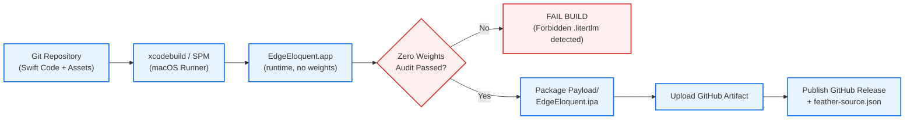
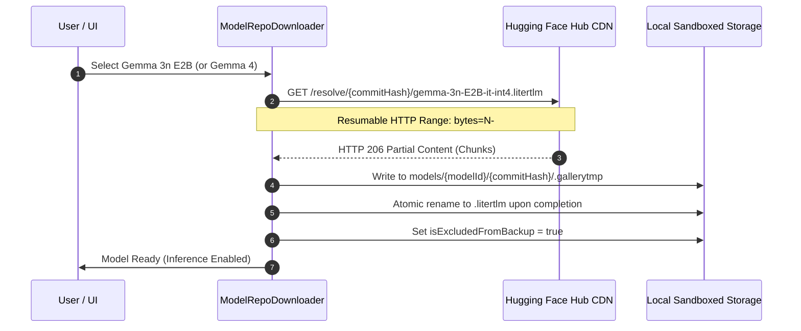

# Edge Eloquent: Comprehensive Build, Packaging & Release Guide

**Document Version:** 1.0.0  
**Target Platform:** iOS 17.0+ (Apple Silicon: A17 Pro, A18 Pro, M-series iPads)  
**Applicability:** Local Development, Unsigned Sideloading, CI/CD Automation  
**Date:** September 2026  

---

## Table of Contents

1. [Executive Summary & Architectural Invariants](#1-executive-summary--architectural-invariants)
2. [Prerequisites & Development Environment](#2-prerequisites--development-environment)
3. [Local Building from Source](#3-local-building-from-source)
   - [3.1 Swift Package Manager (SPM) Dependencies](#31-swift-package-manager-spm-dependencies)
   - [3.2 Building with Xcode IDE](#32-building-with-xcode-ide)
   - [3.3 Command-Line Build via xcodebuild](#33-command-line-build-via-xcodebuild)
   - [3.4 Running Tests Locally](#34-running-tests-locally)
4. [Packaging Unsigned & Ad-Hoc IPAs](#4-packaging-unsigned--ad-hoc-ipas)
   - [4.1 The IPA Packaging Process](#41-the-ipa-packaging-process)
   - [4.2 Packaging Script Breakdown](#42-packaging-script-breakdown)
   - [4.3 Sideload Target Matrix](#43-sideload-target-matrix)
5. [Code Signing Guidelines](#5-code-signing-guidelines)
   - [5.1 Ad-Hoc & Unsigned (Sideload Ready)](#51-ad-hoc--unsigned-sideload-ready)
   - [5.2 Personal Apple ID (Free Developer Account)](#52-personal-apple-id-free-developer-account)
   - [5.3 Paid Apple Developer Program](#53-paid-apple-developer-program)
   - [5.4 Enterprise & Custom Certificates (Feather / SideStore)](#54-enterprise--custom-certificates-feather--sidestore)
   - [5.5 Entitlements & Privacy Declarations](#55-entitlements--privacy-declarations)
6. [Critical Verification: Zero Model Weights in IPA](#6-critical-verification-zero-model-weights-in-ipa)
   - [6.1 The Zero-Weights Invariant](#61-the-zero-weights-invariant)
   - [6.2 Automated Verification Commands](#62-automated-verification-commands)
   - [6.3 How Model Weights Are Acquired Post-Install](#63-how-model-weights-are-acquired-post-install)
7. [GitHub Actions CI/CD Architecture](#7-github-actions-cicd-architecture)
   - [7.1 Workflow Triggers](#71-workflow-triggers)
   - [7.2 Job: Test Suite & Security Assertions](#72-job-test-suite--security-assertions)
   - [7.3 Job: Build & Package Unsigned IPA](#73-job-build--package-unsigned-ipa)
   - [7.4 Job: Automated GitHub Release & Feather Sync](#74-job-automated-github-release--feather-sync)
8. [Troubleshooting & Best Practices](#8-troubleshooting--best-practices)

---

## 1. Executive Summary & Architectural Invariants

Edge Eloquent is an on-device speech intelligence and dictation engine designed for iOS 17.0+. It uses the official Google AI Edge **LiteRT-LM 0.16.1** Swift package. Its model manager admits only audio-capable `.litertlm` artifacts whose repository explicitly declares the LiteRT-LM conversation runtime. VibeVoice-ASR-BitNet is the 4 GB default.

When building, packaging, and distributing Edge Eloquent, developers and CI systems must strictly respect two fundamental architectural invariants:

```
+---------------------------------------------------------------------------------------------------------+
|                                    EDGE ELOQUENT CORE INVARIANTS                                        |
+---------------------------------------------------------------------------------------------------------+
| 1. ZERO WEIGHTS IN BUNDLE:                                                                              |
|    The IPA contains compiled code, UI assets, and LiteRT-LM, but never model weights.                  |
|    Compatible weights are acquired post-launch via resumable HTTP range downloads from Hugging Face.   |
|                                                                                                         |
| 2. STRICT AUDIO AIR-GAP:                                                                                |
|    Microphone audio never leaves device boundaries. Outbound network traffic is structurally            |
|    quarantined to UTF-8 JSON text payloads for optional Cloudflare LLM polish.                          |
+---------------------------------------------------------------------------------------------------------+
```



---

## 2. Prerequisites & Development Environment

To compile and test Edge Eloquent locally, ensure your host system satisfies the following requirements:

| Component | Minimum Version | Recommended Version | Purpose |
| :--- | :--- | :--- | :--- |
| **macOS** | macOS 14.0 (Sonoma) | macOS 14.5+ or 15.0+ (Sequoia) | Host operating system |
| **Architecture** | Apple Silicon (M1/M2/M3/M4) | Apple Silicon (M2 Pro or higher) | Native arm64 Metal pipeline compilation |
| **Xcode** | Xcode 15.4 | Xcode 16.0+ | iOS 17.0+ SDK and Swift compiler |
| **Swift Toolchain** | Swift 5.9 | Swift 5.10 / Swift 6.0 | Modern Swift Concurrency (Actors, Sendable) |
| **Python** | Python 3.10 | Python 3.12+ | Feather source validation and test harness |
| **Zip Utility** | Info-ZIP 3.0+ | Standard BSD / GNU zip | IPA container compression |

### Command Line Tools Setup
Ensure Xcode Command Line Tools are active and correctly pointed:
```bash
sudo xcode-select -switch /Applications/Xcode.app/Contents/Developer
xcodebuild -version
swift --version
```

---

## 3. Local Building from Source

### 3.1 Swift Package Manager (SPM) Dependencies

Edge Eloquent manages its modules and external dependencies using standard Swift Package Manager.

The primary engine dependency is Google AI Edge's LiteRT-LM runtime:
- **Upstream Repository:** `https://github.com/google-ai-edge/LiteRT-LM`
- **Swift Package:** `LiteRTLM` pinned to version `0.16.1`
- **Checksum:** `4e0f683da07566ee79c143d2d58d387f77052b0e6a41562c969e5d2728fc9f4b`

To resolve and pre-fetch package dependencies locally:
```bash
cd /path/to/edge-eloquent
swift package resolve
```

### 3.2 Building with Xcode IDE

1. **Open the Project:**
   - If an `EdgeEloquent.xcodeproj` exists, open it directly in Xcode:
     ```bash
     open EdgeEloquent.xcodeproj
     ```
   - Alternatively, open the directory root containing `Package.swift` in Xcode:
     ```bash
     xed .
     ```
2. **Select Destination:**
   - In the Xcode toolbar destination picker, select **Any iOS Device (arm64)** or your connected physical iPhone/iPad running iOS 17.0+.
   - *Note:* While unit tests can run on the iOS Simulator, real-time Metal GPU inference requires a physical Apple Silicon device.
3. **Configure Signing:**
   - Select the target project in the Project Navigator.
   - Navigate to **Signing & Capabilities**.
   - Under **Signing**, check **Automatically manage signing** and select your Personal or Developer Team.
4. **Build and Run:**
   - Press `Cmd + B` to build.
   - Press `Cmd + R` to deploy and launch on your connected device.

### 3.3 Command-Line Build via `xcodebuild`

To build a Release archive directly from the terminal without signing credentials:

```bash
mkdir -p build

xcodebuild archive \
  -scheme EdgeEloquent \
  -configuration Release \
  -destination "generic/platform=iOS" \
  -archivePath "$PWD/build/EdgeEloquent.xcarchive" \
  CODE_SIGNING_ALLOWED=NO \
  CODE_SIGNING_REQUIRED=NO \
  CODE_SIGN_IDENTITY="" \
  DEVELOPMENT_TEAM="" \
  COMPILER_INDEX_STORE_ENABLE=NO
```

Key build flags explained:
- `CODE_SIGNING_ALLOWED=NO`: Disables codesign invocation during compilation.
- `CODE_SIGNING_REQUIRED=NO`: Allows archiving without a provisioning profile.
- `COMPILER_INDEX_STORE_ENABLE=NO`: Accelerates CI and local build times by skipping indexing.

### 3.4 Running Tests Locally

#### Running Swift Unit Tests
Run the comprehensive test suite (including History Store, Model Lifecycle, and Security Assertion suites):
```bash
swift test --parallel
```

#### Validating Feather Source Metadata
Validate `feather-source.json` against AltStore and Feather repository schemas:
```bash
python3 Tests/validate_feather.py feather-source.json
```

#### Running Repository Security Checks
Verify that no large binary weights have accidentally entered the repository tree:
```bash
chmod +x scripts/assert_no_weights.sh
./scripts/assert_no_weights.sh .
```

---

## 4. Packaging Unsigned & Ad-Hoc IPAs

### 4.1 The IPA Packaging Process

An iOS App Store Package (`.ipa`) is a standard ZIP archive with a strict directory structure:
```
EdgeEloquent.ipa
└── Payload/
    └── EdgeEloquent.app/
        ├── EdgeEloquent (executable binary)
        ├── Info.plist
        ├── Assets.car
        ├── Frameworks/ (CLiteRTLM.framework, etc.)
        └── AppIcon*.png
```

### 4.2 Packaging Script Breakdown

After `xcodebuild archive` finishes, run the packaging sequence:

```bash
# 1. Clean previous build artifacts
rm -rf Payload EdgeEloquent.ipa
mkdir -p Payload

# 2. Copy the compiled .app bundle into Payload/
cp -R "build/EdgeEloquent.xcarchive/Products/Applications/EdgeEloquent.app" Payload/

# 3. Compress into an unsigned IPA with standard Deflate level 9
zip -qr -9 EdgeEloquent.ipa Payload

# 4. Verify IPA size and contents
ls -lh EdgeEloquent.ipa
```

### 4.3 Sideload Target Matrix

The resulting unsigned `EdgeEloquent.ipa` can be installed across all major iOS sideloading ecosystems:

| Sideload Tool | Platform | Signing Requirement | Sideload Mechanism | Refresh Cycle |
| :--- | :--- | :--- | :--- | :--- |
| **Feather** | iOS Device | Custom Certificate (`.p12` + `.mobileprovision`) | Direct on-device import via `feather-source.json` or IPA file | Tied to certificate validity (1 year) |
| **AltStore** | iOS + Mac/Win | Free Apple ID or Paid Developer Account | Sideloaded via AltServer companion app | 7 days (Free) / 365 days (Paid) |
| **SideStore** | iOS Device | Free Apple ID | On-device VPN loopback pairing | 7 days (automatic background refresh) |
| **Sideloadly** | Mac/Windows | Apple ID (Free or Paid) | USB or Wi-Fi direct installation | 7 days (Free) / 365 days (Paid) |
| **TrollStore** | iOS (14.0–17.0) | None (CoreTrust exploit) | Direct permanent install with system privileges | Permanent (No re-signing required) |

> [!TIP]
> **Feather Direct Repository Addition:**  
> Users running Feather can add Edge Eloquent directly by opening `feather://source/https://raw.githubusercontent.com/fuckmmw-afk/edge-eloquent/refs/heads/main/feather-source.json`. Feather will automatically download the IPA, apply the user's certificate, and manage updates.

---

## 5. Code Signing Guidelines

Depending on your distribution and installation method, configure code signing as follows:

```
+---------------------------------------------------------------------------+
|                        CODE SIGNING DECISION TREE                         |
+---------------------------------------------------------------------------+
| Need direct Xcode debugging?        --> Use Personal Apple ID             |
| Sideloading via Feather / SideStore? --> Use Unsigned IPA + Tool Signer    |
| Deploying to TestFlight / App Store? --> Use Paid Apple Developer Program |
| Installing via TrollStore?          --> Use Unsigned / Ad-hoc IPA         |
+---------------------------------------------------------------------------+
```

### 5.1 Ad-Hoc & Unsigned (Sideload Ready)

For distribution through community repositories (Feather, AltStore), build without code signing:
- `CODE_SIGN_IDENTITY=""`
- `CODE_SIGNING_REQUIRED=NO`
- `CODE_SIGNING_ALLOWED=NO`

The sideloading tool (Feather, AltStore, Sideloadly) re-signs the bundle on the fly with the user's signing identity.

### 5.2 Personal Apple ID (Free Developer Account)

Allows installing on your own physical iPhone without paying for the Apple Developer Program:
- **Validity:** 7 days before certificate expiration.
- **Limit:** Maximum 3 active sideloaded apps per device.
- **Entitlements:** Standard App Sandbox, Microphone, Network.
- **Configuration in Xcode:**
  1. Add your Apple ID in **Xcode > Settings > Accounts**.
  2. In your project target, select your personal team `Your Name (Personal Team)`.
  3. Xcode automatically provisions a free development profile.

### 5.3 Paid Apple Developer Program

Required for permanent ad-hoc signing, TestFlight, and App Store distribution:
- **Validity:** 1 year.
- **Entitlements:** Standard network client access. Model transfers are resumable across app launches using HTTP Range requests, but are not advertised as indefinite background execution.
- **Profile Type:** `Apple Development` (for internal testing) or `iOS Distribution` (for App Store / Ad-Hoc).

### 5.4 Enterprise & Custom Certificates (Feather / SideStore)

Users utilizing P12 distribution certificates (e.g., Apple Developer Enterprise Program or UDID-registered developer slots):
1. Import `.p12` certificate and `.mobileprovision` file into **Feather**.
2. Select `Edge Eloquent` from the imported source.
3. Feather signs the application using the custom bundle identifier and entitlements matched to the provisioning profile.

### 5.5 Entitlements & Privacy Declarations

Edge Eloquent requires the following permissions declared in its `Info.plist`:

```xml
<!-- Microphone Usage: Required for on-device acoustic capture -->
<key>NSMicrophoneUsageDescription</key>
<string>Edge Eloquent requires microphone access to transcribe your spoken voice directly on your device.</string>

<!-- Model transfers use HTTPS Range resumption; no background mode is declared. -->
<key>UIBackgroundModes</key>
<array>
    <string>fetch</string>
</array>
```

For devices running 4-bit Gemma models with extended KV-caches, the following memory entitlements are configured when building with a paid developer profile:
- `com.apple.developer.kernel.extended-virtual-addressing` (Boolean: `true`)
- `com.apple.developer.kernel.increased-memory-limit` (Boolean: `true`)

---

## 6. Critical Verification: Zero Model Weights in IPA

### 6.1 The Zero-Weights Invariant

> [!CAUTION]
> **Never package `.litertlm`, `.bin`, `.task`, or `.tflite` model files inside the IPA.**  
> Bundling weights inflates the application package beyond Apple's 200 MB cellular download limit, causes memory bloating during unpacking, and breaks sideloading on AltStore and Feather.

The complete Edge Eloquent IPA binary footprint is strictly constrained:
- **Allowed Contents:** Mach-O executable, compiled Swift libraries, `CLiteRTLM.framework`, assets (`Assets.car`), UI icons, and strings.
- **Expected IPA Size:** below **150 MB**, including the official runtime but excluding model weights.
- **Prohibited Extensions:** `.litertlm`, `.bin`, `.task`, `.tflite`, `.gguf`, `.onnx`, `.weights`, `.safetensors`, `.pth`, `.pt`.

### 6.2 Automated Verification Commands

Always audit the packaged IPA prior to distribution:

#### 1. Using the Project Verification Script
```bash
chmod +x scripts/assert_no_weights.sh
./scripts/assert_no_weights.sh EdgeEloquent.ipa
```
Expected output:
```text
=== Checking target: EdgeEloquent.ipa for prohibited model weights ===
Inspecting IPA archive: EdgeEloquent.ipa
SUCCESS: IPA is clean (18524160 bytes). No model weights detected.
```

#### 2. Manual Zip Inspection
```bash
unzip -l EdgeEloquent.ipa | grep -iE "\.litertlm|\.bin|\.task|\.tflite|\.gguf|\.onnx|\.safetensors"
```
*If this command outputs any matches, the build MUST be aborted.*

#### 3. Total Archive Size Assertion
```bash
IPA_SIZE=$(stat -f%z EdgeEloquent.ipa 2>/dev/null || stat -c%s EdgeEloquent.ipa 2>/dev/null)
echo "IPA Size: $IPA_SIZE bytes"
test "$IPA_SIZE" -lt 52428800 || (echo "ERROR: IPA exceeds 50MB limit!" && exit 1)
```

### 6.3 How Model Weights Are Acquired Post-Install

Instead of bundling weights, Edge Eloquent downloads them on demand after the user chooses their preferred engine in the UI:



1. **Target Sandbox:** `Library/Application Support/EdgeEloquent/models/{modelId}/{commitHash}/`
2. **iCloud Exclusion:** Directory is marked with `URLResourceValues.isExcludedFromBackup = true` to satisfy Apple App Store Guideline 2.2.
3. **Integrity Check:** Files are verified against exact expected byte sizes and pinned Git-LFS SHA-256 digests before being loaded into `CLiteRTLM`.

---

## 7. GitHub Actions CI/CD Architecture

The automated pipeline is defined in [`.github/workflows/build-and-release.yml`](../.github/workflows/build-and-release.yml).

### 7.1 Workflow Triggers

The workflow runs automatically on:
- **Push to `main`**: Runs tests, audits repository hygiene, and builds the ad-hoc IPA.
- **Push to tags `v*`** (e.g. `v1.0.0`): Runs tests, packages the IPA, updates `feather-source.json`, and deploys a GitHub Release.
- **Pull Requests to `main`**: Runs the full test suite and verifies clean builds.
- **Manual Trigger (`workflow_dispatch`)**: Allows ad-hoc manual execution with custom parameters.

### 7.2 Job: Test Suite & Security Assertions

- **Runner:** `macos-14` (Apple Silicon M1/M2)
- **Steps:**
  1. Select Xcode 15.4 / 16.0.
  2. Execute Swift unit tests in parallel (`swift test --parallel`).
  3. Validate `feather-source.json` using `Tests/validate_feather.py`.
  4. Run repository hygiene assertion (`scripts/assert_no_weights.sh .`).

### 7.3 Job: Build & Package Unsigned IPA

- **Runner:** `macos-14`
- **Dependency:** Requires `test` job to succeed (`needs: [test]`).
- **Steps:**
  1. Archive the application with `xcodebuild archive` without code signing.
  2. Package the compiled `EdgeEloquent.app` into `Payload/`.
  3. Compress into `EdgeEloquent.ipa`.
  4. **Critical Gate:** Run `scripts/assert_no_weights.sh EdgeEloquent.ipa` to verify that no model files leaked into the IPA.
  5. Assert total IPA size is under 50 MB.
  6. Upload the IPA as a build artifact (`actions/upload-artifact@v4`).

### 7.4 Job: Automated GitHub Release & Feather Sync

- **Runner:** `ubuntu-latest`
- **Condition:** Triggered only on version tags (`startsWith(github.ref, 'refs/tags/v')`).
- **Dependency:** Requires `build-and-package` (`needs: [build-and-package]`).
- **Steps:**
  1. Download `EdgeEloquent.ipa` from the packaging job.
  2. Extract semantic version from git tag (`v1.0.0` $\to$ `1.0.0`).
  3. Inspect exact IPA size in bytes.
  4. Dynamically update `feather-source.json` (updating release version, ISO date, download URL, and byte size).
  5. Validate modified `feather-source.json` with `Tests/validate_feather.py`.
  6. Publish GitHub Release with `softprops/action-gh-release@v2`, attaching:
     - `EdgeEloquent.ipa`
     - `feather-source.json`

---

## 8. Troubleshooting & Best Practices

### Problem: `xcode-select: error: tool 'xcodebuild' requires Xcode`
**Resolution:** Select the Xcode application directory:
```bash
sudo xcode-select -s /Applications/Xcode.app/Contents/Developer
```

### Problem: Build fails with `Missing package product 'LiteRTLM'`
**Resolution:** Clear local Swift Package Manager caches and re-fetch:
```bash
rm -rf .build ~/Library/Caches/org.swift.swiftpm/
swift package reset
swift package resolve
```

### Problem: Metal pipeline compilation crash on Simulator
**Reason:** Multimodal LiteRT-LM kernels require hardware Apple Silicon GPU features (Metal 3, Apple Family 7+ MSL compute).  
**Resolution:** Always target a physical device (`generic/platform=iOS` or connected iPhone) when building for inference.

### Problem: App crashes on launch with memory warning (Jetsam)
**Reason:** An 8GB iPhone enforces a ~4.5 GB resident memory limit per application. Loading a 4-bit model while background memory pressure is high triggers Jetsam `0xdead10cc`.  
**Resolution:** Ensure `audioBackend` is set to `.cpu()` (not `.gpu`), and close heavy background camera or game applications before launching continuous dictation sessions.

---
*Edge Eloquent Build Documentation &copy; 2026 Edge Eloquent Authors. Distributed under the Apache 2.0 License.*
