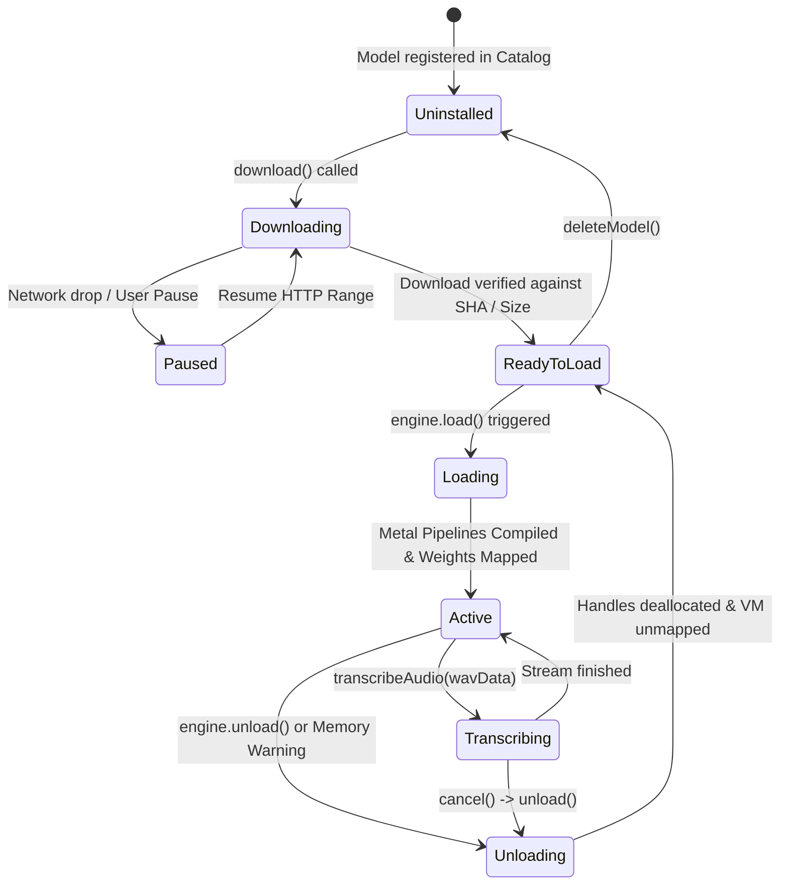

# Edge Eloquent: Model Ecosystem & Multimodal Infrastructure Specification

**Document Version:** 1.0.6
**Target Platform:** iOS 17.0+ (Apple Silicon: A14 and newer, M-series)
**Upstream Runtime:** Google AI Edge LiteRT-LM 0.16.1

> **iOS support note:** The application searches Hugging Face for audio-capable `.litertlm` bundles. Qwen3-ASR 0.6B is the default for 4 GB devices; VibeVoice-ASR-BitNet is the likely approximately 1.87 GB model remembered from AI Edge Gallery discovery. Other file formats are shown as incompatible and cannot be imported into LiteRT-LM.
**Distribution Model:** Dynamic On-Demand Delivery via Hugging Face Hub (Zero IPA Weights)  
**Date:** September 2026  

---

## 1. Google AI Edge Gallery Ecosystem & Model Allowlists

### 1.1 The Google AI Edge Ecosystem
Google AI Edge represents Google's consolidated framework for running high-performance, generative machine learning models directly on edge devices (smartphones, tablets, and embedded hardware). At the center of this ecosystem are:

1. **LiteRT (Lightweight Runtime, formerly TensorFlow Lite):** The execution engine providing cross-platform hardware acceleration delegates (Apple Metal, ARM NEON, Android NNAPI/GPU/NPU).
2. **LiteRT-LM:** The specialized generative AI runtime layer providing LLM-specific inference pipelines (K/V-cache management, speculative decoding, multi-token prediction, SentencePiece tokenization, and constrained grammar decoding via `llguidance`).
3. **Google AI Edge Gallery (`google-ai-edge/gallery`):** Google's reference consumer application showcasing on-device AI capabilities across chat, mobile actions, multimodal visual question answering, and audio comprehension.

### 1.2 Upstream Model Allowlists Architecture
Google manages certified edge models through versioned JSON allowlists. Rather than requiring application binary updates to introduce newly validated models or updated commit checkpoints, the runtime pulls allowlist definitions over the air:

- **`model_allowlist.json` / `model_allowlists/`:** The canonical directory inside `google-ai-edge/gallery`.
- **`ios_1_0_0.json`:** The production allowlist certified for iOS devices, enforcing memory-budgeted checkpoints compatible with Apple Silicon unified memory constraints.
- **`1_0_19.json`:** The bleeding-edge Android/unified allowlist introducing 32K context windows, chain-of-thought reasoning (`llm_thinking`), and Multi-Token Prediction (`speculative_decoding`).

#### Why Edge Eloquent Combines Search with Pinned Metadata
The built-in choices provide known repository revisions, exact sizes, and SHA-256 digests. Live Hugging Face search expands that catalog without pretending that every repository can run: only metadata-confirmed audio `.litertlm` artifacts are importable.
- **4 GB Devices:** Qwen3-ASR 0.6B is the lightweight default and supports Russian.
- **Remembered ~1.87 GB Model:** VibeVoice-ASR-BitNet is 1,983,019,248 bytes (1.847 GiB), but its published language list does not include Russian.
- **Legacy Compatibility:** Gemma 3n E2B/E4B descriptors remain available for existing downloads, though their 6/8 GB recommendations exceed the iPhone 12 memory budget.
- **Integrity:** The repository commit selects the immutable download revision; the LFS SHA-256 separately verifies the downloaded bytes.
- **Fallback Capability:** Edge Eloquent provides an instant zero-download fallback engine (`AppleOnDeviceSpeechEngine` using native iOS `SFSpeechRecognizer`) for zero-storage or low-memory scenarios.

---

## 2. Supported Audio-Capable Models Specification

Edge Eloquent ships no weights. It provides these pinned starting points plus compatible models imported from Hugging Face search and the zero-download Apple native speech engine.

```
+---------------------------------------------------------------------------------------------------------+
|                                  EDGE ELOQUENT MODEL CATALOG                                            |
+---------------------------------------------------------------------------------------------------------+
|  Model Name         | HF Repository                            | Target File          | Size    | RAM   |
+---------------------+------------------------------------------+----------------------+---------+-------+
|  Qwen3-ASR-0.6B     | litert-community/Qwen3-ASR-0.6B          | qwen3_asr_0.6b_5s_i8 | 0.96 GB | 4 GB  |
|  VibeVoice ASR      | litert-community/VibeVoice-ASR-BitNet    | VibeVoice-ASR-BitNet | 1.98 GB | 4 GB  |
|  Gemma-3n-E2B-it    | google/gemma-3n-E2B-it-litert-lm         | gemma-3n-E2B-it-int4 | 3.39 GB | 6 GB  |
|  Gemma-3n-E4B-it    | google/gemma-3n-E4B-it-litert-lm         | gemma-3n-E4B-it-int4 | 4.65 GB | 8 GB  |
|  Apple Native Speech| system-embedded                          | SFSpeechRecognizer   | 0 bytes | 4 GB  |
+---------------------------------------------------------------------------------------------------------+
```

### 2.1 Legacy Gemma Research Matrix

The matrix below is retained for architectural research. It is not the v1.0.6 download menu and its Gemma 4 rows are not built-in selectable models.

| Specification | Gemma-4-E2B-it (Recommended) | Gemma-4-E4B-it (High-Capacity) | Gemma-3n-E2B-it (Baseline) | Gemma-3n-E4B-it (Extended) | Apple Native Speech |
| :--- | :--- | :--- | :--- | :--- | :--- |
| **Model Display Name** | Gemma-4-E2B-it | Gemma-4-E4B-it | Gemma-3n-E2B-it | Gemma-3n-E4B-it | Apple Native Speech |
| **Hugging Face Model ID** | `litert-community/gemma-4-E2B-it-litert-lm` | `litert-community/gemma-4-E4B-it-litert-lm` | `google/gemma-3n-E2B-it-litert-lm` | `google/gemma-3n-E4B-it-litert-lm` | `apple/on-device-speech` |
| **Target Model File** | `gemma-4-E2B-it.litertlm` | `gemma-4-E4B-it.litertlm` | `gemma-3n-E2B-it-int4.litertlm` | `gemma-3n-E4B-it-int4.litertlm` | System Framework |
| **Size in Bytes** | `2,588,147,712` (~2.59 GB) | `3,659,530,240` (~3.66 GB) | `3,388,604,416` (~3.39 GB) | `4,652,318,720` (~4.65 GB) | 0 Bytes (Resident) |
| **Minimum Device RAM** | **8 GB** | **12 GB** | **6 GB** | **8 GB** | **4 GB** |
| **Commit Hash (Pinned)**| `6e5c4f1e395deb959c494953478fa5cec4b8008f` | `28299f30ee4d43294517a4ac93abd6163412f07f` | `73b019b63436d346f68dd9c1dbfd117eb264d888` | `3d0179a0648381585ab337e170b7517aae8e0ce4` | `system` |
| **Alternative Hash** | `7fa1d78473894f7e736a21d920c3aa80f950c0db` | `9695417f248178c63a9f318c6e0c56cb917cb837` | — | — | — |
| **LLM Accelerator** | `gpu` (Metal MSL) | `gpu` (Metal MSL) | `gpu` (Metal MSL) | `gpu` (Metal MSL) | Apple Neural Engine / CPU |
| **Audio Accelerator** | `cpu` (ARM NEON) | `cpu` (ARM NEON) | `cpu` (ARM NEON) | `cpu` (ARM NEON) | Apple Neural Engine / CPU |
| **Vision Accelerator** | `gpu` (Metal MSL) | `gpu` (Metal MSL) | `gpu` (Metal MSL) | `gpu` (Metal MSL) | N/A |
| **Supported Task Types**| `["llm_ask_audio", "llm_chat"]` | `["llm_ask_audio", "llm_chat"]` | `["llm_ask_audio", "llm_chat"]` | `["llm_ask_audio", "llm_chat"]` | `["llm_ask_audio"]` |
| **Max Context Tokens** | 32,000 | 32,000 | 4,096 | 4,096 | Continuous Streaming |
| **Max Output Tokens** | 4,000 | 4,000 | 4,096 | 4,096 | System Managed |
| **Speculative Decoding**| Multi-Token Prediction (MTP) | Multi-Token Prediction (MTP) | Unsupported | Unsupported | N/A |
| **Reasoning Channel** | `llm_thinking` channel | `llm_thinking` channel | Unsupported | Unsupported | N/A |
| **Target iOS Hardware** | iPhone 15 Pro, iPhone 16 / 16 Pro | iPhone 16 Pro Max, M2/M4 iPad | iPhone 15 Pro, iPhone 16 | iPhone 15 Pro Max, M-series iPad | All iOS 17+ devices |

---

## 3. Model Architecture & `.litertlm` Format Deep Dive

The `.litertlm` artifact is a unified FlatBuffers binary container custom-engineered for high-throughput edge execution.

```
+-----------------------------------------------------------------------+
|                       .litertlm BINARY CONTAINER                      |
+-----------------------------------------------------------------------+
|  [Header & Metadata]                                                  |
|  - Magic Bytes: "LTLM" (FlatBuffers identification)                   |
|  - 64-byte alignment flags for zero-copy POSIX mmap()                  |
|  - Capabilities flags (Speculative decoding, MTP, KV-cache structure) |
+-----------------------------------------------------------------------+
|  [Embedded Tokenizer]                                                 |
|  - SentencePiece Byte-Pair Encoding (BPE) vocabulary model            |
|  - Embedded special tokens (<start_of_turn>, <audio_token>, etc.)     |
+-----------------------------------------------------------------------+
|  [Acoustic Projector Graph]                                           |
|  - Universal Speech Model (USM) / Conformer Encoder                   |
|  - Subsampling convolutional front-end + Relative Attention blocks    |
|  - Linear projection into LLM token embedding dimension               |
+-----------------------------------------------------------------------+
|  [Visual Projector Graph (Multimodal Only)]                           |
|  - SigLIP / ViT Vision Transformer blocks                             |
+-----------------------------------------------------------------------+
|  [Quantized LLM Backbone Weights]                                     |
|  - 4-bit Integer Linear Weights (int4) with per-block-32 scale factor |
|  - FP16 Activation tensors & RMSNorm weights                          |
|  - Speculative draft heads (MTP heads for Gemma-4)                    |
+-----------------------------------------------------------------------+
```

### 3.1 4-Bit Weight Quantization (int4)
Inference on consumer mobile memory channels (30–60 GB/s bandwidth on A17/A18) is strictly memory-bandwidth bound. Running 16-bit float weights for a 2-billion-parameter model requires streaming 4 GB per autoregressive token step, capping generation at ~7 tokens/sec.

With `int4` quantization:
- Weights are stored as signed 4-bit integers with symmetric or asymmetric min/max scaling over 32-element blocks (`block_size = 32`).
- Scales and zero-points are packed as half-precision floats (`fp16`).
- Memory footprint drops by ~75% compared to `fp16` baselines.
- Apple Metal compute kernels unpack `int4` into `half` registers on the fly using hardware SIMD vector instructions, achieving generation rates of **20–35 tokens/sec** on A17 Pro / A18 Pro.

### 3.2 Integrated SentencePiece Tokenizer
Separate tokenizer files (e.g. `tokenizer.model` or `vocab.json`) frequently introduce deployment desynchronization. In the `.litertlm` format:
- The SentencePiece BPE vocabulary is serialized directly into the FlatBuffers header.
- Token lookup, text detokenization, and byte-fallback decoding are executed in C++ natively by LiteRT-LM without cross-process IPC or file I/O overhead.

### 3.3 Conformer Speech Projector & Multimodal Subgraphs
Gemma's multimodal audio processing is not a separate acoustic model followed by text passing; it is end-to-end continuous speech understanding:
1. **Acoustic Input:** 16,000 Hz, 1-channel, 16-bit signed Linear PCM (standard RIFF WAV).
2. **Log-Mel Filterbanks:** Audio is converted into 80-dimensional log-mel spectrogram features.
3. **Conformer Subsampling:** Universal Speech Model (USM) Conformer layers compress the temporal axis by a factor of 4x.
4. **Projection:** A linear projection layer maps the subsampled acoustic representations directly into the LLM's token embedding space.
5. **Token Density:** 1 second of spoken audio yields approximately **25 to 50 acoustic token embeddings**.

### 3.4 Hardware Backend Splitting: GPU vs. CPU
Multimodal speech models require distinct execution backends for their constituent subgraphs:
- **LLM Projection & Transformer Decode:** `.gpu` (Apple Metal Shading Language). The recurrent matrix multiplications benefit directly from the high parallel compute capacity of Apple Silicon GPUs.
- **Audio Conformer Encoder:** `.cpu()` (ARM NEON vectorized CPU instructions). The subsampling convolutions and time-reduction layers in Google's LiteRT Conformer delegate are heavily optimized for NEON registers. Initializing `audioBackend` as `.gpu` fails on iOS Metal delegates.

---

## 4. Binary Distribution Invariant: Zero Weights in Application Bundle

Edge Eloquent enforces an immutable architectural invariant:

> **No model weights are ever bundled within the application IPA binary or committed to source control.**

```
+------------------------------------------------------------------------------------------------+
|                                    IPA DISTRIBUTION VS MODEL WEIGHTS                           |
+------------------------------------------------------------------------------------------------+
|  [App Store Distribution: IPA File]                                                            |
|  - Compiled Swift Machine Code (arm64)                                                         |
|  - CLiteRTLM.xcframework C++ Native Binaries (Metal Shaders, Tokenizer)                        |
|  - UI Assets, Icons, Localizations, Audio Pipeline Helpers                                     |
|  TOTAL IPA SIZE: runtime included, model weights excluded; release gate is 150 MB              |
+------------------------------------------------------------------------------------------------+
                                              |
                                              | Post-Install On-Demand Download
                                              v
+------------------------------------------------------------------------------------------------+
|  [Hugging Face Hub CDN (HTTP 206 Resumable)]                                                   |
|  - GET https://huggingface.co/litert-community/gemma-4-E2B-it-litert-lm/resolve/...             |
|  - Range: bytes=N-                                                                             |
|  - Bearer Token Auth (Gated Models)                                                            |
|  DOWNLOAD SIZE: 2.59 GB - 4.65 GB                                                              |
|  LOCAL STORAGE: Library/Application Support/EdgeEloquent/models/{modelId}/{commitHash}/        |
|  BACKUP EXCLUSION: isExcludedFromBackup = true                                                 |
+------------------------------------------------------------------------------------------------+
```

### 4.1 Rationale for Strict Binary Exclusion
1. **Apple App Store Review Guidelines & Binary Size Limits:**
   - Apple caps universal binary download sizes over cellular connections (warning at 200 MB).
   - Apple imposes a strict maximum of **4 GB per uncompressed application slice**. Models like `Gemma-3n-E4B-it` (4.65 GB) literally cannot be packaged into an IPA without violating App Store submission limits.
2. **Rapid Iteration & Release Velocity:**
   - App updates include the LiteRT-LM runtime but never multi-gigabyte model weights.
   - Forcing users to download a 3.5 GB app update for a one-line bug fix leads to abandonment and user frustration.
3. **Storage Tiering & User Discretion:**
   - Users decide whether the lower-memory Gemma 3n E2B or higher-capacity Gemma 3n E4B fits their device and storage situation.
   - Users without available storage can immediately transcribe using the built-in `AppleOnDeviceSpeechEngine` without downloading anything.
4. **Gated License Compliance (Google Responsible AI):**
   - Gemma models are distributed under Google's Responsible AI Terms of Use. Hosting weights directly in an IPA circumvents Hugging Face user acceptance terms. On-demand downloading allows users to supply their Hugging Face User Access Token (Bearer Token) to authenticate gated repositories.

### 4.2 Hugging Face Download Protocol & Resumption Flow
Downloads are orchestrated via `URLSessionDownloadTask` with HTTP `Range` headers:
1. **Metadata Discovery:** App queries `https://huggingface.co/api/models/{modelId}?blobs=true` to obtain the commit SHA-256 and exact byte length.
2. **Chunked Resumption:** If an interrupted download file (`<model>.downloadtmp`) exists with length `N`, the client issues:
   ```http
   GET /{modelId}/resolve/{commitHash}/{modelFile} HTTP/1.1
   Host: huggingface.co
   Range: bytes=N-
   Accept-Encoding: identity
   Authorization: Bearer <hf_token>
   ```
3. **Atomic Finalization:** Upon receiving the final byte matching `sizeInBytes`, the file is verified against the pinned commit hash and atomically renamed to `<modelFile>`.

---

## 5. Memory Management, Lifecycle & iOS Jetsam Budgets

### 5.1 iOS Jetsam Resident Memory Constraints
On Apple Silicon iPhones, unified memory is shared between the CPU, GPU, display pipeline, and iOS system daemons. The Darwin kernel enforces strict per-process resident memory limits known as **Jetsam limits**.

```
Memory Budget Analysis (8 GB Device: iPhone 15 Pro / iPhone 16):
+-------------------------------------------------------------+
|  Physical RAM: 8,192 MB                                     |
+-------------------------------------------------------------+
|  OS Daemons, SpringBoard, Metal System: ~2,500 MB           |
|  Maximum Allowed App Footprint (Jetsam Limit): ~4,800 MB     |
|                                                             |
|  Edge Eloquent Resident Allocation (Gemma-4-E2B):            |
|  - Quantized Weights (mmap virtual pages): ~2,588 MB        |
|  - KV Cache Buffer (32,000 max tokens):    ~650 MB         |
|  - Metal Compute Scratch & Shader Kernels:  ~320 MB         |
|  - Audio Slices & App UI:                   ~150 MB         |
|  ---------------------------------------------------------- |
|  Total Resident Set Size:                   ~3,708 MB       |
|  Headroom to Jetsam Limit:                  ~1,092 MB (Safe)|
+-------------------------------------------------------------+
```

If an app allocates beyond the Jetsam threshold (e.g. attempting to run `Gemma-3n-E4B` on an 8 GB iPhone), the OS kernel immediately terminates the process with termination reason:
`EXC_RESOURCE -> 0xdead10cc (Jetsam memory kill)`.

### 5.2 Complete Model Lifecycle State Machine



### 5.3 Model Switching & Teardown Protocol
Because two large models cannot coexist simultaneously within the 4.8 GB Jetsam envelope, switching models requires a strict four-step teardown protocol:

```swift
// Models/Lifecycle: Safe Model Switching Protocol
public func switchModel(from currentEngine: SpeechModelEngine?, to newEngine: SpeechModelEngine) async throws {
    // 1. Cancel in-flight transcription and release stream continuations
    if let current = currentEngine, current.isLoaded {
        // 2. Explicitly unload active engine
        await current.unload()
    }
    
    // 3. Force cooperative task yield to allow Darwin VM to unmap pages
    await Task.yield()
    
    // 4. Load the new engine
    try await newEngine.load()
}
```

### 5.4 Cache & Sandboxed Directory Architecture
All model assets and temporary compilation artifacts are isolated strictly within standard iOS sandboxed directories:

1. **Model Weights Directory:**
   `Library/Application Support/EdgeEloquent/models/{modelId}/{commitHash}/`
   - Files stored here are persistent across application launches.
   - The directory is explicitly flagged with `URLResourceValues.isExcludedFromBackup = true` to prevent iCloud backup inclusion (preventing rejection under App Store Review Guideline 2.2).
2. **LiteRT Compilation Cache Directory:**
   `Library/Caches/LiteRTCache/{modelId}/`
   - Houses compiled Apple Metal Binary Archives (`.metallib` / PSO caches).
   - Can be safely purged by iOS under severe storage pressure without corrupting model weights.
3. **Scratch Audio Directory:**
   `tmp/EdgeEloquent/audio/`
   - Houses temporary 16kHz WAV slices passed to the engine via `Content.audioFile(path)`.
   - Purged immediately upon session completion.

---

## 6. The Critical Multimodal Audio Prompt Ordering Rule

Under Google LiteRT-LM's multimodal attention implementation, **audio content tokens must precede prompt text tokens** when serializing multimodal messages:

```swift
// CORRECT: Audio content placed before text instruction
let message = Message(
    of: .audioData(wavData),
    .text("Transcribe the speech accurately with punctuation. Return only the recognized text.")
)
```

```swift
// INCORRECT: Text placed before audio induces hallucinations
let malformed = Message(
    of: .text("Transcribe the following:"),
    .audioData(wavData)
)
```

**Architectural Rationale:**  
When the autoregressive transformer begins decoding, attention keys and values for acoustic tokens must already reside in the KV-cache sequence. Placing text first causes the model to begin generating continuation text before conditioning on the full acoustic embedding sequence, resulting in repetitive loops or hallucinated responses.

---

## 7. Architecture Summary & Best Practices

1. **Never commit weights to Git or package them in the Xcode target bundle.**
2. **Always configure `audioBackend = .cpu()`** and `backend = .gpu` when initializing `EngineConfig`.
3. **Enforce chunked dictation windows (15 to 30 seconds max)** to prevent KV-cache context overflow on 4,096-token models.
4. **Always provide `AppleOnDeviceSpeechEngine`** as an instant zero-storage fallback for immediate dictation.
5. **Verify file byte sizes and git commit hashes** prior to calling `Engine.initialize()`.
